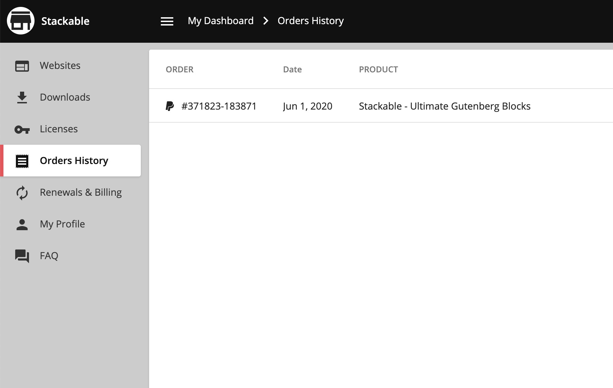
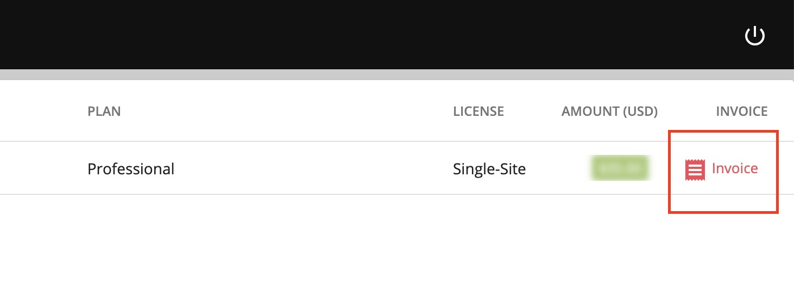

# How Can I Get An Invoice for My Purchase?

Yes, you can get your invoice by in your account page.



While inside your Stackable account, navigate to **Orders History**

On the right hand side, click on the **Invoice** button to view the PDF of your invoice.

If you need to change the details in your invoice, you can edit your details in **My Profile**.



