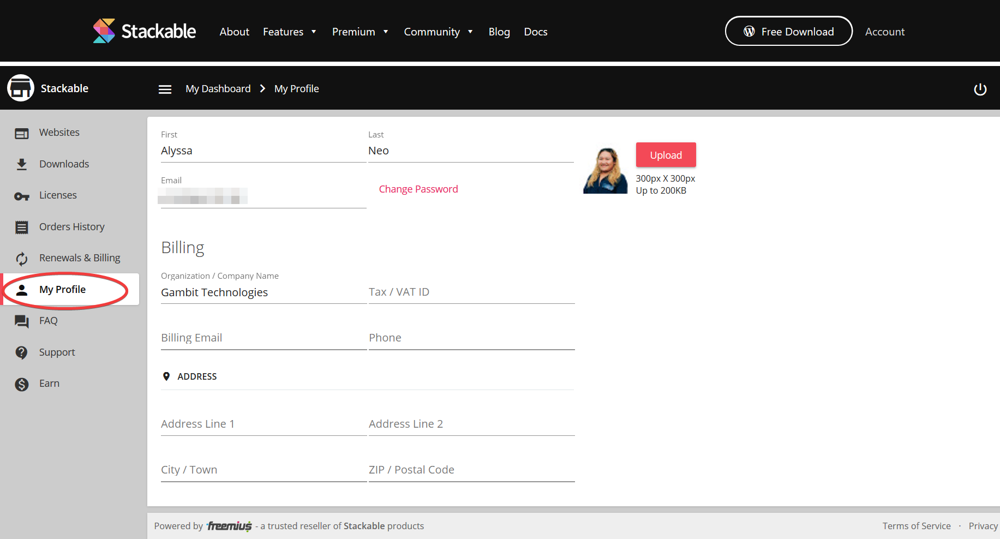

# How Do I Edit My Account Information in My Invoice?

If you need to change the details in your invoice, you can edit your details in **My Profile** in your account.



After updating your profile, your invoice should automatically get updated with the new details.

