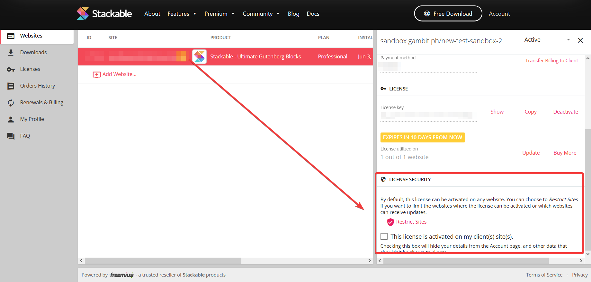

# How to Hide License Key and Account Information From Clients \(TODO\)

We have a **White Label** feature that hides your license and account details on your client's site.

**How To Do It**

* Log into your Stackable account through this link: [https://wpstackable.com/account/\#!/login](https://wpstackable.com/account/#!/login)
* Click your license
* Click the option "This license is activated on my client sites"

Once checked, your license key and other info will be hidden from the admin.

