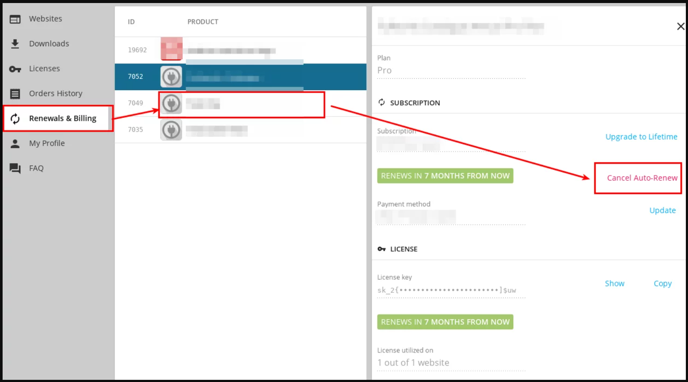
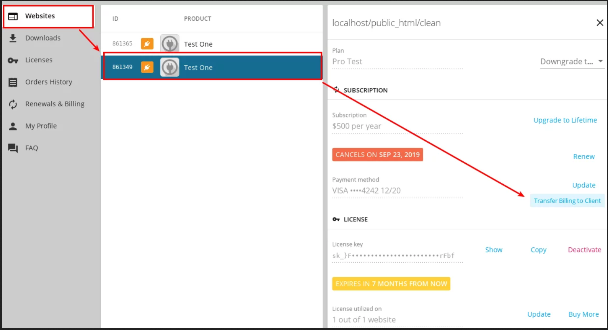
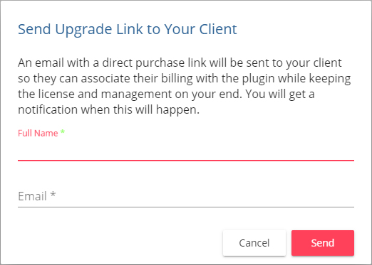

# How to Transfer Account to your Client

If you have created a website for your client and you have purchased Stackable Premium on their behalf, you can transfer the ownership and billing of Stackable Premium to your client.

You can easily transfer billing to your client by logging into your account in Stackable.



Once logged in navigate to **Renewals and Billings**, then select your plan and click on **Cancel Auto-Renew**.

Afterwards, navigate to **Websites** and click on your client’s website in the list. Then click on “**Transfer Billing to Client**“.

When you're done, a popup will open which will notify your client of the transfer. Input your client’s name and email. An email with a direct purchase link will be sent to your client so they can associate their billing with Stackable Premium while keeping the license and management on your end. You will get a notification when this will happen.

