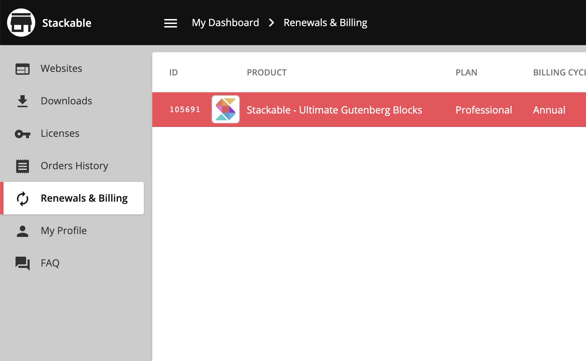
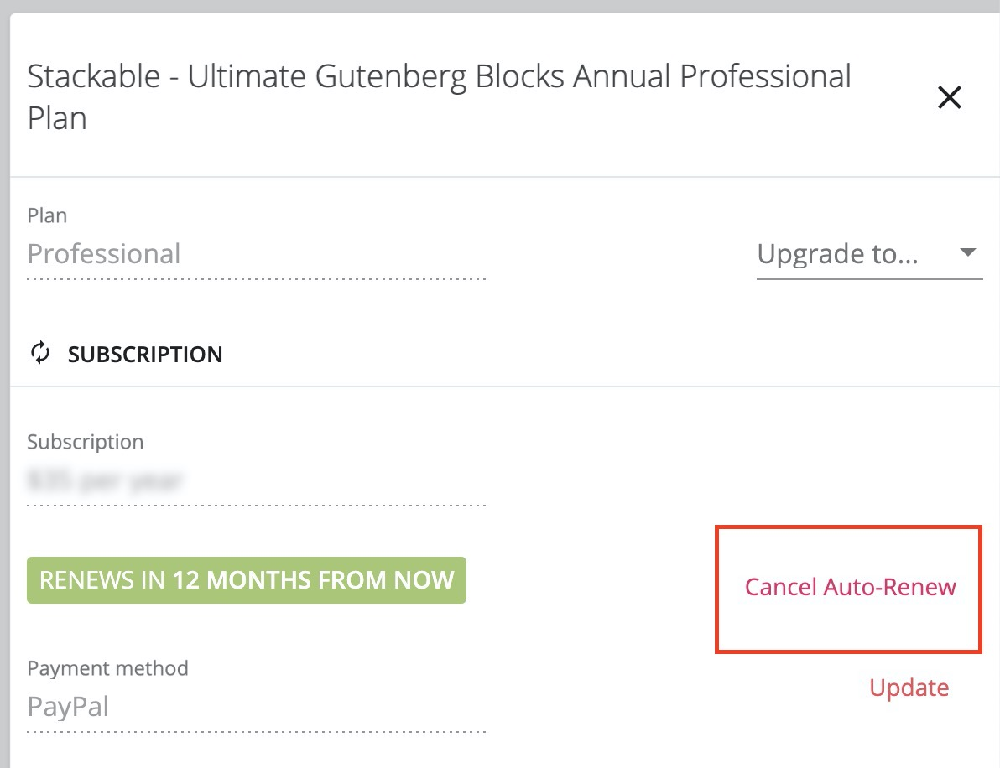

# Can I Cancel My Auto-Renewal?

You can cancel your auto-renewal any time through your account.



While inside your Stackable account, navigate to **Renewals & Billing**

Then click on one of your purchases to see its details.

Click on the **Cancel Auto-Renew** button to cancel your renewal. 

