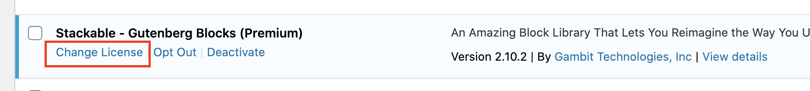
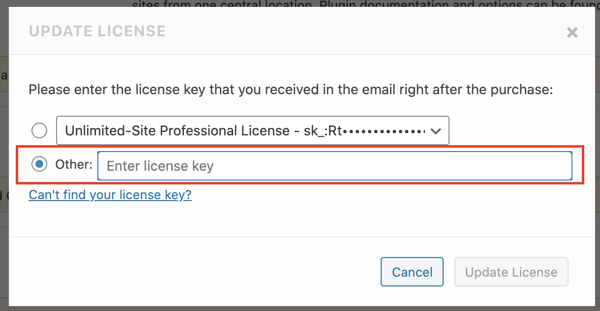

# How Do I Change My License Key?

If you want to change the current license key that's activated in your website, you can do so by heading first to your plugin list. Look for Stackable, and then click on **Change License**

Afterwards, a popup will open where you can enter in your license key.

Click on **Update License** to activate your other license key.

