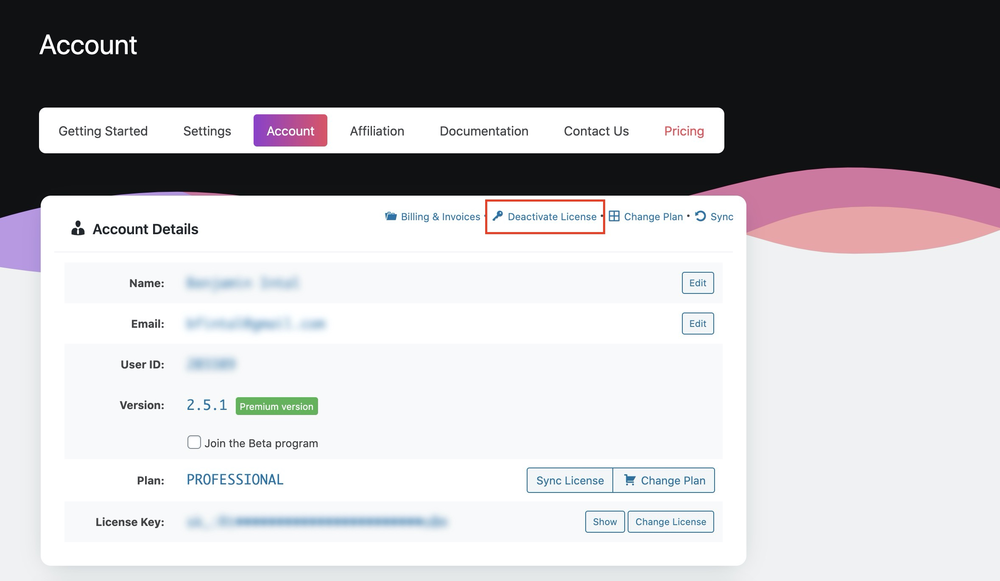
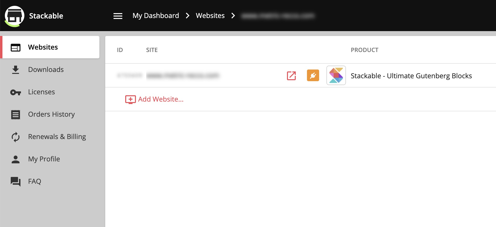
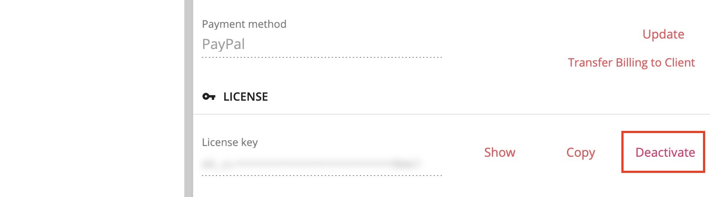

# How Do I Deactivate My License Key?

### 1. From Your WordPress Dashboard

To deactivate your License Key, just log into your website then navigate to **Stackable &gt; Account** in your WordPress dashboard.

Once in there, click on **Deactivate License**.

### 2. From Your Account Dashboard


This is useful if you don't have access to the website where you have Stackable Premium activated anymore.


You can also log into your account in [wpstackable.com](https://wpstackable.com/) and perform the License Key deactivation from there.



Once logged in, just head over to **Websites** from the menu.

Click on the website you want to deactivate your License Key on, then on the details pane that opens up, click on the **Deactivate** link to deactivate your License Key from that site.

