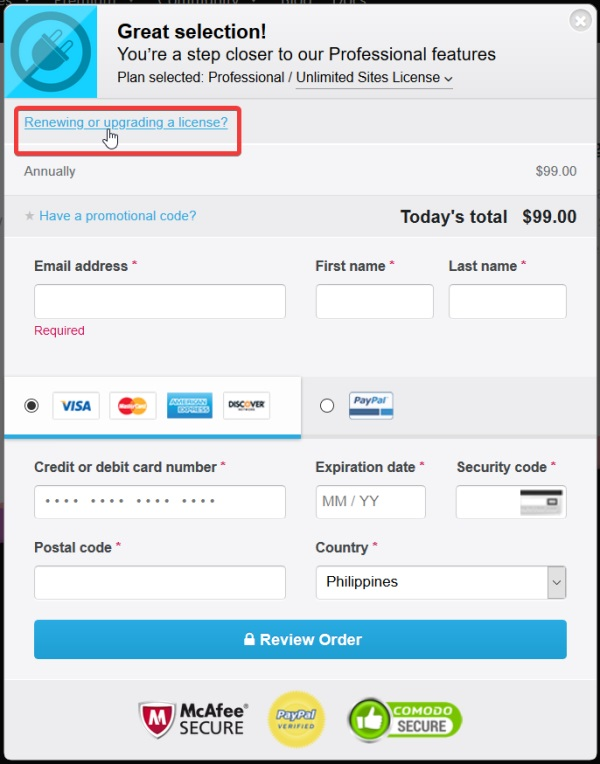

# How to Upgrade My Current Plan?

If you wish to upgrade from a Single License to an Unlimited License here are the steps:

* Purchase the Unlimited Site License on our [website](https://wpstackable.com/premium/#pricing-table).
* Before checking out click **Renewing or upgrading a license?** then enter your current Single Site License Key.

* Proceed to checkout.


You should get a prorated discount if you upgrade your license.


