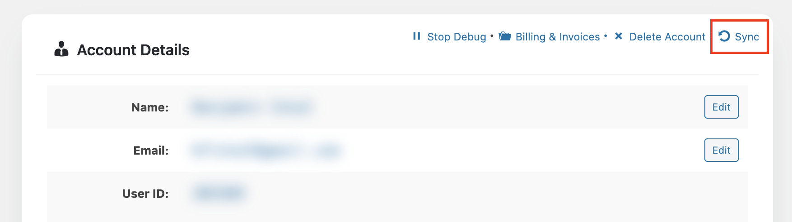
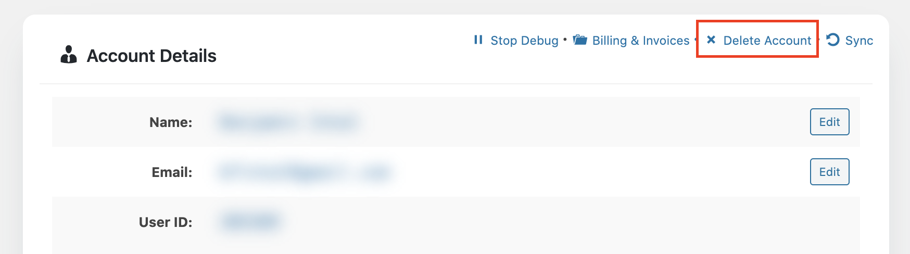
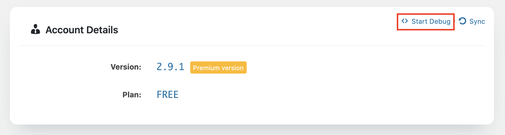
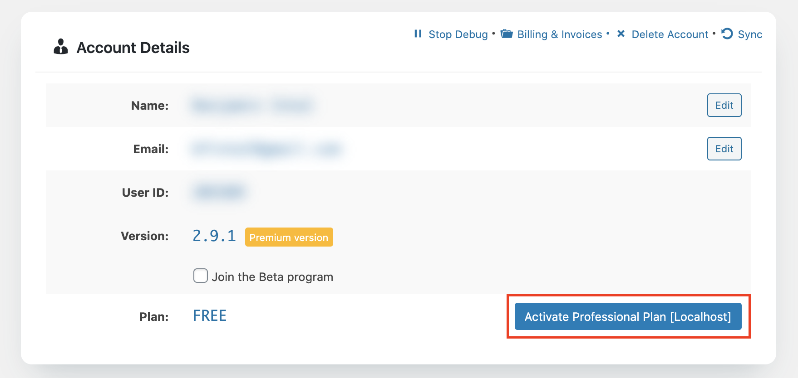
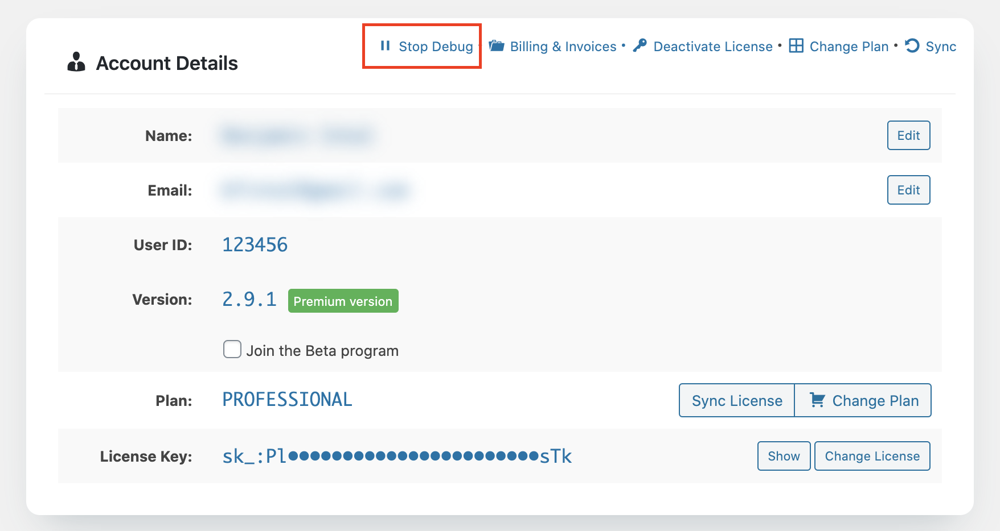

# I Activated My License Key but It Still Shows Stackable as Free

First make sure you have the Stackable Premium installed and not the free version of Stackable, and that you have your license key activated.





If your account under **Stackable &gt; Account** in your WordPress dashboard incorrectly shows your account as Free, you can try the following to fix the issue:

### 1. Try Syncing your site

In **Stackable &gt; Account**, click on the **Sync** button on the upper right of your account details area. Refresh the page afterwards and see whether this fixes the problem.

### 2. Try Deleting your Account


Before doing this method, make sure that you have your license key at hand. You can log in your account at [https://wpstackable.com/account](https://wpstackable.com/account) to grab it.


In **Stackable &gt; Account**, click on the **Delete Account** button on the upper right of your account details area. Doing this will only delete your account details stored in your site, and will not actually delete your Stackable Premium account.

After doing this, you will be asked for your license key again. Enter it to activate your copy of Stackable Premium, this should fix the status of your website.

### 3. Try Starting Debug Mode

If the first two steps above do not work or if you can't perform them. In **Stackable &gt; Account**, click on the **Start Debug** button.

Afterwards, you should start seeing your license information. From here, you can either click on **Delete Account** \(perform step 2 above\), or click on **Activate Plan.**

This should update your license information. After this, click on the **Stop Debug** button.

