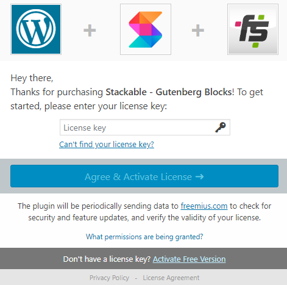
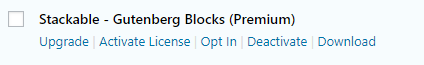

# Activating your license key

After purchasing the Stackable Premium, you should receive an e-mail from us with your Stackable Premium copy and your license key.

You need to upload the Stackable Premium in your plugins. After uploading, you need to deactivate the free version then activate the Stackable Premium. After you've activated it you'll be able to see a prompt like this:

 You can enter your license key in the field. But if you missed this screen, you can also activate it via **Plugins**:

After the activation, the Stackable premium will be ready to use! Afterwards, all the Stackable blocks that you've already used will now have premium options. 👍





