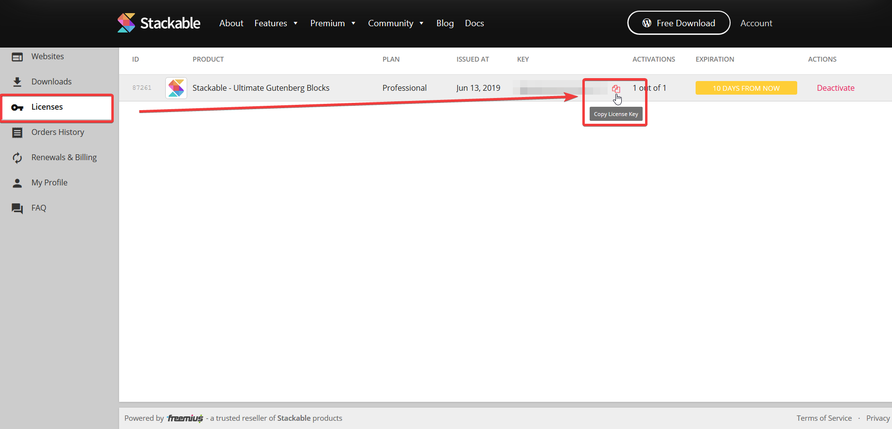

# Where Can I Find My License Key? \(TODO\)

 This tutorial will teach you where to find your License Key. \(For Stackable Premium customers only\)

### **Through the “Thank You” Email**

The first place to look for Stackable if in the “Thanks for Upgrading” email we sent you when you first became our customer. There should be a download link for the plugin as well as your license key inside the email.

### **Through the Site**

* Head over to [https://wpstackable.com/account/](https://wpstackable.com/account/) and log into your account. If you don’t know what your login credentials are, we sent them to you in our “Thank you for Upgrading” email. If you can’t find that email, use the email address you used to purchase Stackable and you can also reset your password if needed.
* Once logged in, navigate to the **Licenses** area on the side menu and you should be able to find your license key from there.


If you don't remember your password, you can retrieve your password by clicking on the "Never received your password?", you'll receive an email with a reset password link.


### **By contacting the support**

* You can always contact us to help you to find your license key.
* Just email us your email address that you've used when purchasing Stackable Premium.

