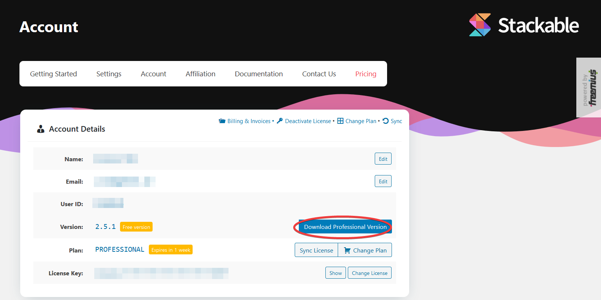

# Where Do I Download Stackable Premium?

There are a number of ways to download the Stackable Premium plugin:

### 1. **Through the “Thank You” Email**

The first place to look for Stackable if in the “Thanks for Upgrading” email we sent you when you first became our customer ❤️There should be a download link for the plugin inside the email.

### **2. Through your WordPress Site Admin**

*  If you have the free version of Stackable installed and activated, on your WordPress dashboard, navigate to **Stackable &gt; Account**.
* Enter in your license key if you haven’t yet, and you should be able to see your account details.
* Click the **Download Professional Version** button to download the Premium plugin

### **3. Through the Site**

* Head over to [https://wpstackable.com/account/](https://wpstackable.com/account/) and log into your account. If you don’t know what your login credentials are, we sent them to you in our “Thank you for Upgrading” email. If you can’t find that email, use the email address you used to purchase Stackable and you can also reset your password if needed.
* Once logged in, navigate to the **Downloads** area on the side menu and you should be able to find the Premium plugin from there.

