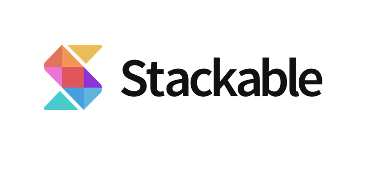
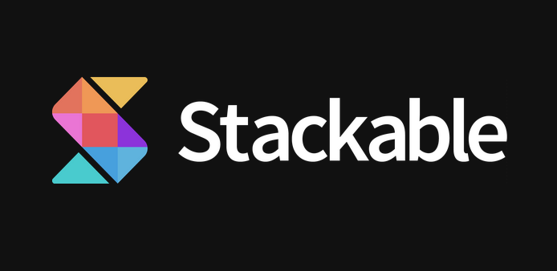
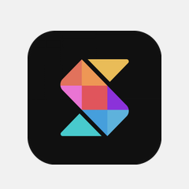
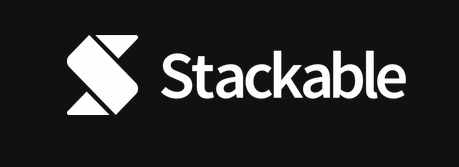
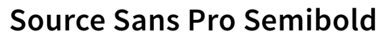

# Branding Guidelines

If you're writing an article about Stackable you can grab our logos and colors here.

### Main Logos

Icon with name

Icon only

Icons with border


For use against backgrounds including gradient and images when the main logo tends to get drowned out against the background


### Secondary Logo

Icon with name \(White\)

Icon only \(White\)


For use in black and white displays or printing


### Typeface

### Main Colors

* Black: \#111111
* Purple: \#8C33DA
* Red: \#F34957
* Gradients: \#8C33DA to \#F34957

