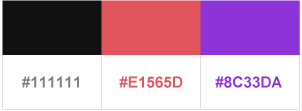
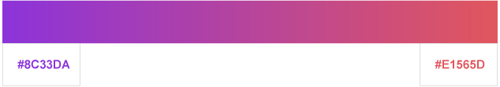
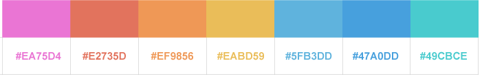

# Branding Guidelines \(TODO\)

### Main Logos

Icon with name

Icon only

Icons with border


For use against backgrounds including gradient and images when the main logo tends to get drowned out against the background


### Secondary Logo

Icon with name \(White\)

Icon only \(White\)


For use in black and white displays or printing


### Colors and Typography

Typeface

Main Colors

Gradient Colors

Other Colors \(Logo Icon\)

