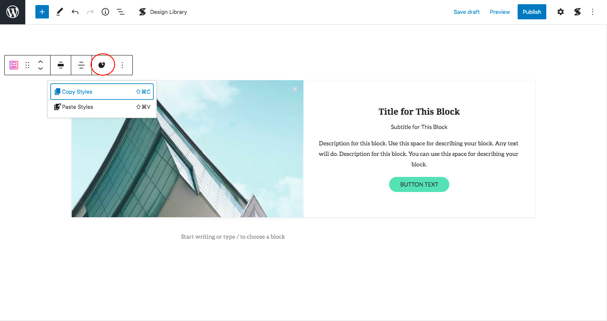
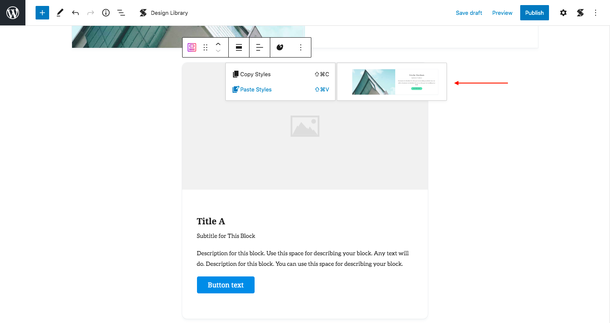
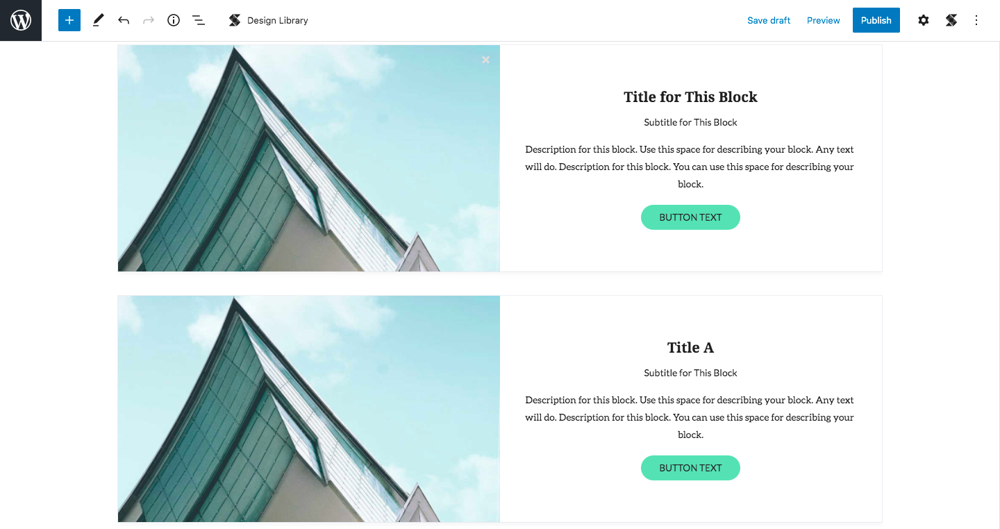
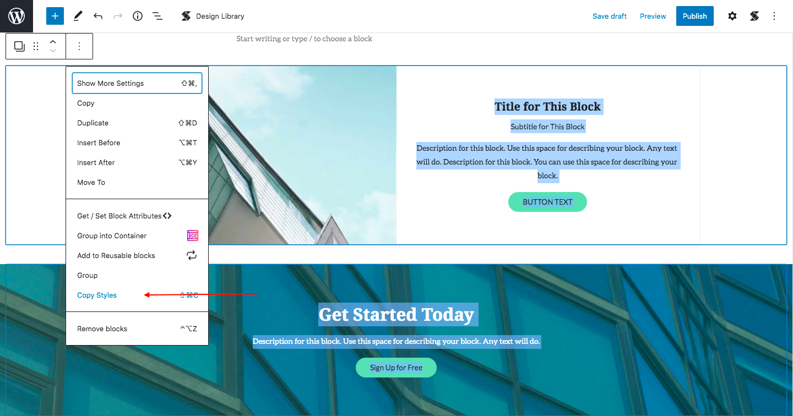
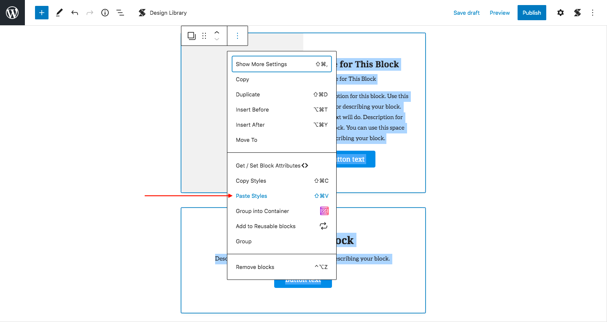
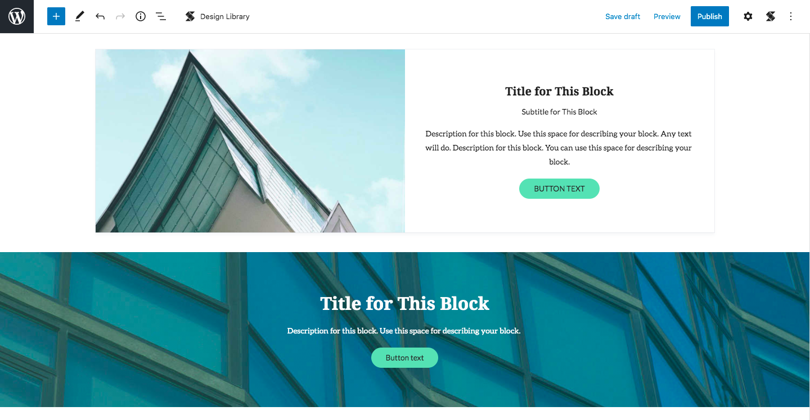

# Copy Paste Styles


This feature is only available in Stackable Premium


The Copy Paste Styles is a feature that will allow you to copy the styles of one block and paste it to another so you don't have to manually duplicate it anymore. Pretty self-explanatory right? Yes, it's a simple concept, but a very useful one that is!

The good thing about this new feature is that it supports multi-selection, meaning you can copy multiple block styles. You can also copy paste styles in different posts and pages!

**How to Use Stackable Copy Paste Styles**

* Add the block you want to use
* Design it any way you want to
* Click on the **Copy Paste Styles** icon on the toolbar
* Select "Copy Styles"

* Select the block you want to paste the style to

* Click on the Copy Paste Styles icon &gt; Click Paste Styles

* You can also copy multiple block styles
* Multi-select the blocks you want to copy
* Click "Copy Styles"

* Multi-select the blocks you want to paste the styles to
* Click "Paste Styles_"_

You can also copy paste styles in different posts and pages! 👍🏼

