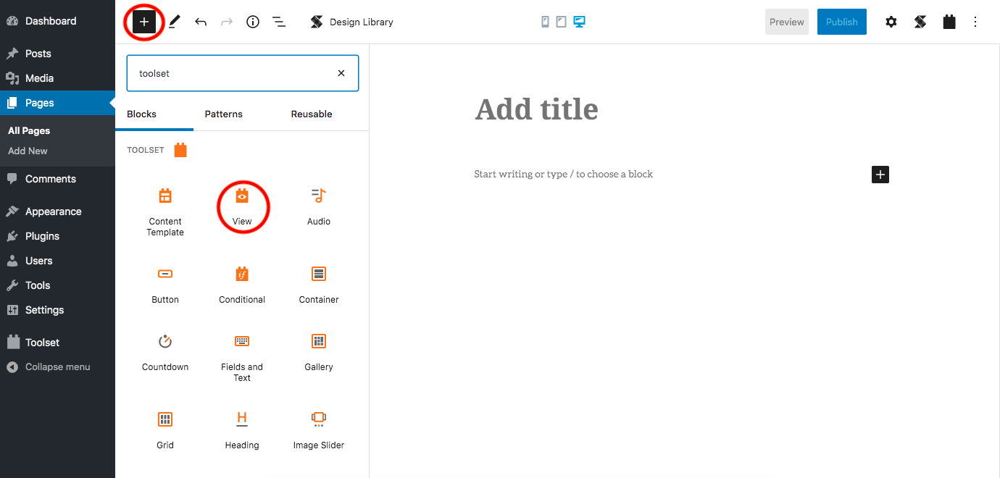
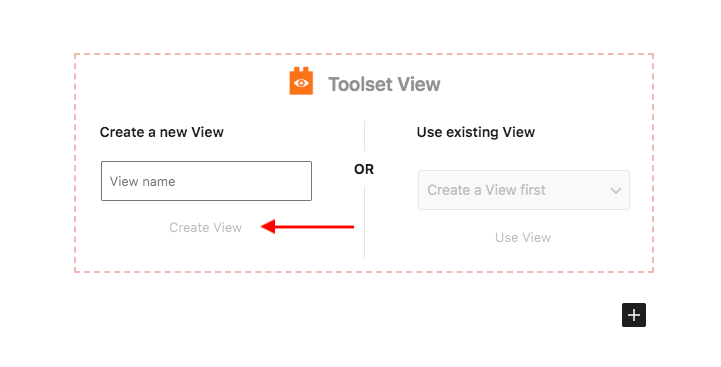
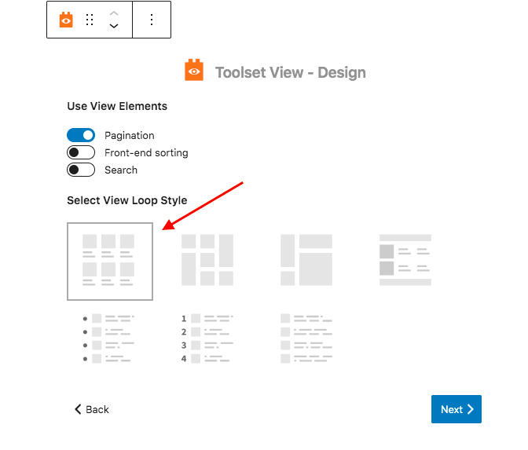
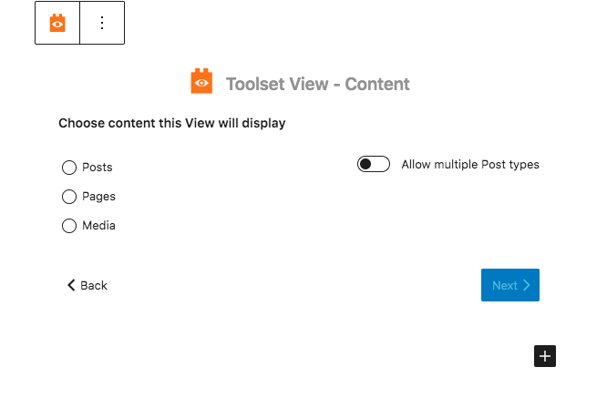
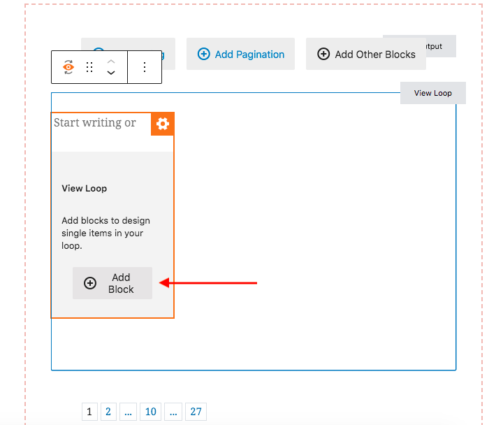
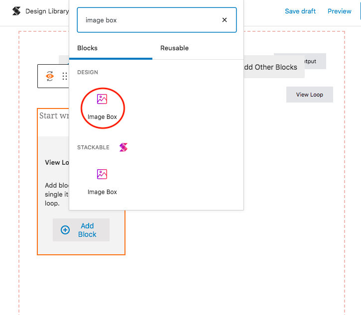

# Dynamic Sources with Toolset Integration


You need a **Toolset** subscription to enjoy the benefits of this integration. To use Dynamic Sources, you will need to activate **Toolset Blocks** and **Toolset Types**.


You can now start using dynamic sources with our latest integration with [Toolset](http://toolset.com/). The possibilities are now endless since this will allow you to easily display existing content from standard fields, custom fields and taxonomy in Stackable’s Gutenberg blocks.

You can find the list of compatible blocks in Toolset's [documentation](https://toolset.com/documentation/dynamic-sources-in-popular-blocks/).

**Adding a Stackable Block Inside Toolset View Block**

* Click on the plus \(+\) sign on the upper left side of the screen
* Search for the Toolset blocks and select the "View" block

* After adding the block, type in your view name and click "Create View"

* Select what view elements you will use
* Choose your view loop style \(for this example, we will use the default Grid\)
* Click on "Next"

* Choose what content you want the View to display
  * For this example, we will select "Media"

* Now, insert a Stackable block you want \(make sure it's compatible\)
  * For this example, we will select the Image Box block

* Make the necessary adjustments on the Stackable block in the Inspector
  * Columns, Height, Borders, etc.



