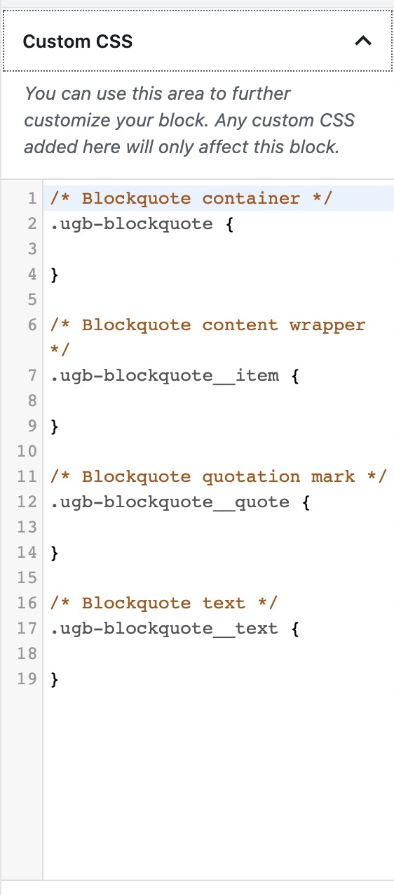
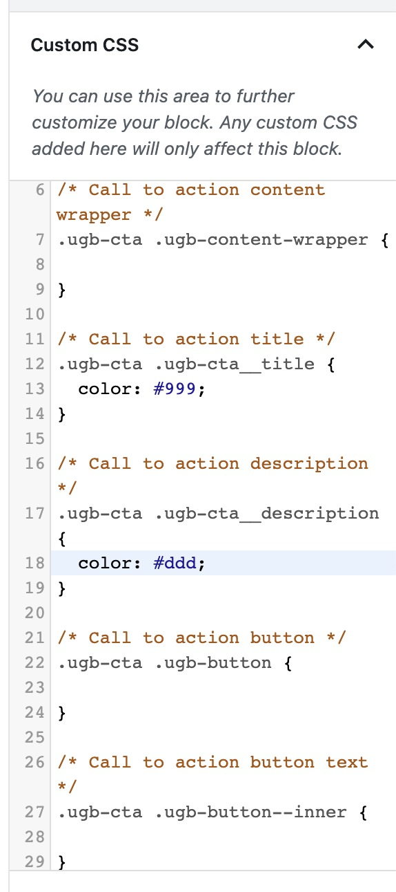

# Guided Custom CSS


This feature is only available in Stackable Premium


If you are a premium user, there will be a new options panel named **Custom CSS** in your **Advanced Tab**.

When you open it, you should see something like this:

Any CSS styles you enter here will only be applied to the _current block you are editing_. You won’t have to worry about your styles affecting unwanted places.

You might be wondering why we call this feature “guided”, this simply means that we’ve already laid out for you a list of CSS classes you’ll need in order to modify the block through CSS. You won’t have to dive into the block’s source to find out the CSS class names.

Just fill out the necessary areas with your own style rules.

After adding your custom CSS, the block should show your changes right away.

You don’t also have to worry about the empty CSS selectors, Stackable removes the unused ones so that we can keep your pages loading fast.

