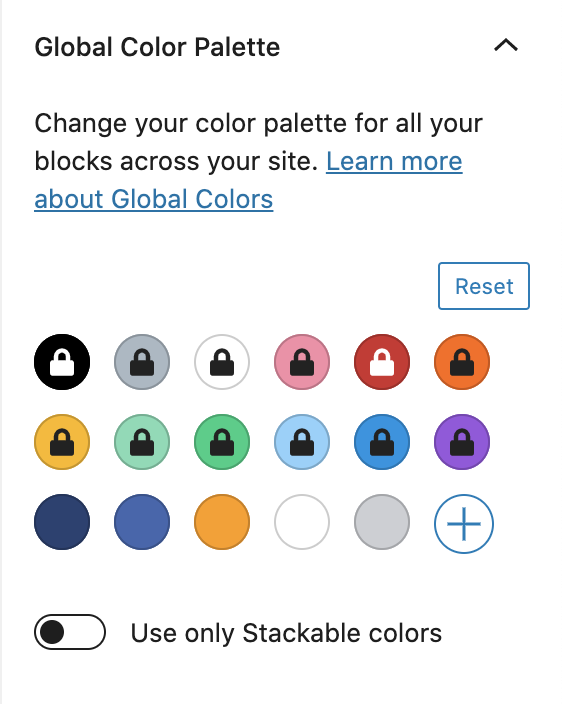

# How to Use Global Colors

Global Colors allow you to create a _dynamic_ color palette for your entire website.

Unlike normal colors provided by themes, blocks that use Stackable's global colors are bound to that color and will change when the global color is changed. This makes it easier for you to create a unified color palette across your entire website, and perform adjustments across the board.


The power of Global Colors come from the binding of colors across your different webpages. You can tweak your global color palette and your entire site will adjust!


## Accessing the Global Colors

You can access the Stackable Global Colors by clicking on the Stackable logo on the upper right of the Block Editor.

## The Color Palette Provided by Your Theme is Locked

Your theme provides its own colors. These colors are locked and cannot be modified. This means that if your theme has their own global colors, then you can still use that without any issues.

If you want to create your own color palette without colors provided by your theme, you can enable the "**Use only Stackable colors**" option.

## Adding a Global Color

By clicking on the **plus button**, you can add more colors and name them in your color palette.

Each color you add would permanently adjust the color pickers found across your blocks \(not just for Stackable blocks\). You can add as many colors as you like!

## Adjusting Global Colors

You can adjust any global color at any time by clicking on the color. Be careful when adjusting global colors since any Stackable and native blocks that use that color will also adjust to the new color that you select.

## Deleting Global Colors

You can delete any colors that you've added any time by clicking on the color and clicking on the **Delete Color** link. You can also **Reset** your entire color palette to bring it back to the defaults.


Be careful when delete colors! When the color you're deleting is currently being used by a block, that color will become unlinked:

* For **Stackable blocks**, an unlinked global color will still continue to show the color
* For **Native blocks**, an unlinked global color will now default back to the initial color provided by the theme / browser \(text will become black, backgrounds will become white or be removed\)


