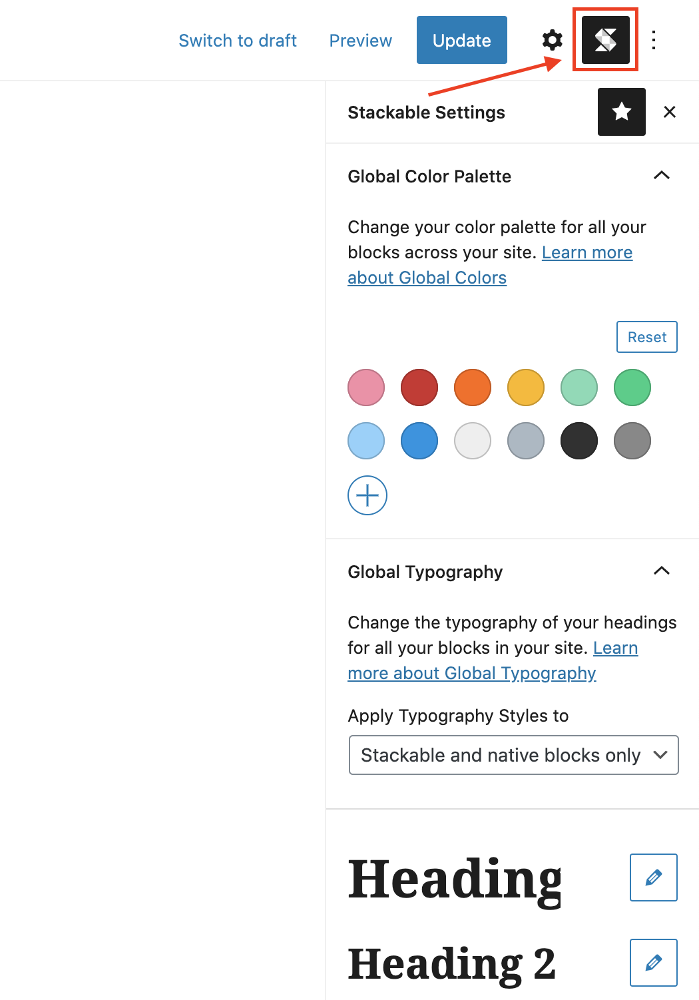

# How to Use Global Settings

To access the Stackable Global Settings, click on the Stackable icon on the top right of the Block Editor.

The Global Settings is composed of global colors and global typography settings:





