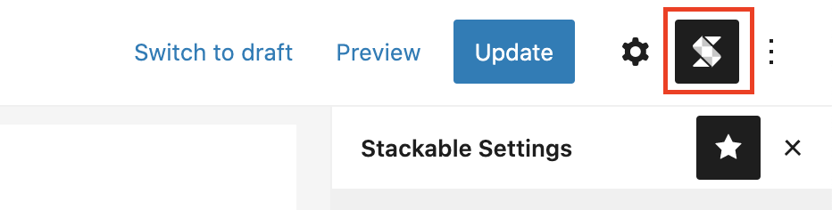
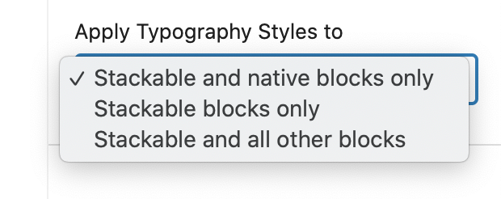

# How to Use Global Typography

Global Typography allows you to specify the typography styles of your headings and text across all your blocks.


The power of Global Typography comes from being able to adjust your text styles across your different webpages. You can tweak your global typography and your entire site will adjust!


## Accessing the Global Typography

You can access the Stackable Global Typography by clicking on the Stackable logo on the upper right of the Block Editor.

## Adjusting Global Typography

Simply click on the **Pencil / edit button** to open the typography settings and adjust the styles for your headings. All changes are live and will automatically reflect in your webpages.

You can choose whether to apply the typography styles to also native blocks and other third-party blocks as well.


We cannot guarantee that the typography styles will work against the options of other block plugins since each block plugin works differently.


Once you've modified a Global Typography for a heading, you can still further customize it on a per block level.

## Adjusting Tablet and Mobile Global Typography

Some typography settings can be adjusted specifically for tablet and mobile screen sizes. 

To adjust these,  use the responsive toggles and select tablet or mobile then edit your typography settings while in tablet or mobile view modes.

## Theme Compatibility

If the global typography settings are not working in the frontend of your theme, you can tweak some of the settings found in **Stackable &gt; Global Settings**

* **Content Selector** - usually theme's content area contains the CSS class `.entry-content` if your theme uses a different class to designate the content area, please put the proper selector here.
* **Force Typography Styles** - if your theme's doesn't display the global typography that you set, then you may enable this to force the typography styles in the frontend. Ideally, you should not enable this and should be the last resort to make your typography work.

