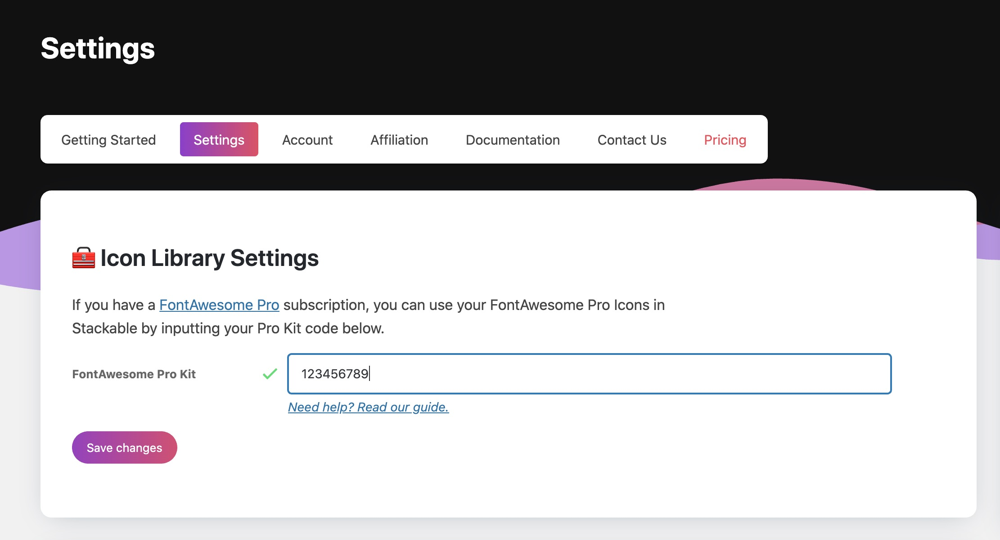

# How to Use Your Font Awesome Pro Icons

If you have an active [**Font Awesome Pro subscription**](https://fontawesome.com/referral?a=2c8dfc8669), then you can easily start using your Pro icons inside your Stackable blocks.


This feature is only available in Stackable Premium, 

You will also need a [Font Awesome Standard subscription](https://fontawesome.com/referral?a=2c8dfc8669) or higher to use Font Awesome Pro icons.


You will need to set up your Font Awesome Pro account first in order to use your Pro icons. You can set it up in 2 ways: 1\) with a Font Awesome Pro Kit code, or 2\) with the Font Awesome WordPress plugin.

## 1. Setting up with your Font Awesome Pro Kit Code

### Get Your Kit Code

To find your Font Awesome Pro Kit code, you'll have to go to your Kits page in Font Awesome's website here: [https://fontawesome.com/kits/](https://fontawesome.com/kits/)

Once there, click on your Font Awesome Kit to open up its details. Note that if you don't have a Font Awesome Kit yet, you'll have to create one.

The code that we need is the one that looks like:

```text
<script src="https://kit.fontawesome.com/1234567890.js" crossorigin="anonymous"></script>
```


### Make sure your Kit is using Pro Icons.

Only Font Awesome Kits that have **Pro SVG icons** enabled are accepted by Stackable. Make sure your Kit settings are correct and you the following settings:

* **Icons** set to **Pro**
* **Technology** set to **SVG**

Follow the screenshot below:


### Inputting your Kit Code in Stackable.

To use your Font Awesome Kit code, log in your site's backend and navigate to **Stackable &gt; Settings** and input your code in the correct field.



After inputting the code, it will get verified first. If the code is correct, it should display a green check mark. You can now save your settings.

## 2. Setting up with the Font Awesome WordPress Plugin

If you're already using the [Font Awesome WordPress Plugin](https://wordpress.org/plugins/font-awesome/), all you need to do is to make sure your settings in that plugin are set to use your Pro icons, and Stackable should be able to automatically use them.

Dive into the settings of the Font Awesome plugin and make sure you are either using a Pro Kit or the CDN with the following settings:

* **Icons** set to **Pro**
* **Technology** set to **SVG**

Follow the screenshots below as a guide.


## How Will I Know if I'm Using Font Awesome Pro Icons?

If your settings are correct, then you should already see your Font Awesome Pro icons in any icon picker in Stackable blocks.

For reference, the free icons would look like this:


If you have Pro icons, it would look like this:


