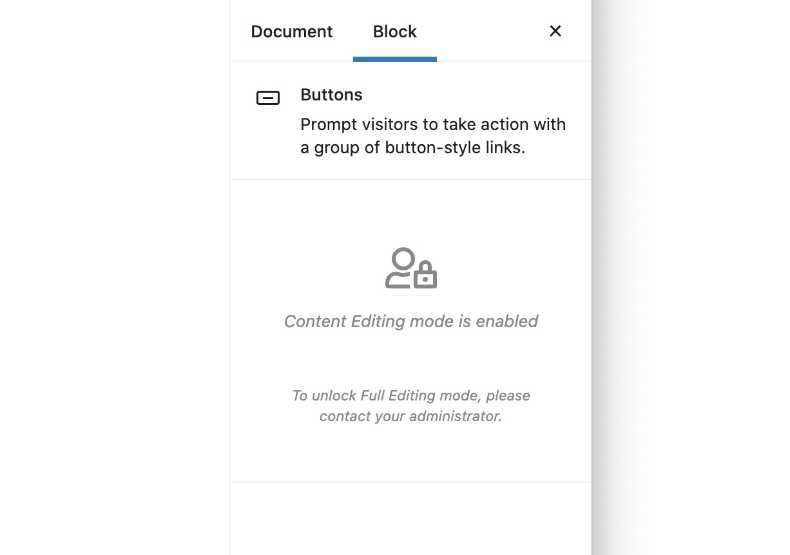

# Role Manager and Content Editing Mode

In WordPress, each user is assigned roles. These roles allow or restrict users to do specific things in your site. You can learn more about [WordPress roles here](https://wordpress.org/support/article/roles-and-capabilities/).

**Stackable allows you to assign different editing modes to different user roles.** This is especially helpful if you want to allow your clients to edit the content the site, but do not want them to alter the design of your blocks.


This feature is only available in Stackable Premium


## Assigning Editing Modes via The Role Manager

To assign different editing modes, just go to **Stackable &gt; Settings**. 

Under the **Role Manager** area, you can change the editing modes for each user role:

* **Full editing mode** - you have full controls over the styles of every block.
* **Content only editing mode** - the inspector is locked and you cannot modify the settings of the block, you can however still modify the block's content \(text, images, icons\).


Content only editing mode applies to **ALL** blocks and not just Stackable blocks.


In Content Only Editing mode, the user will only see this when a block is selected:

## How Content Only Editing Works

Content Only Editing works by locking out the inspector in order to prevent the user from editing the styles of blocks.


In this mode, the inspector is locked. It does not however, prevent the user from editing styles outside the inspector. This means that advanced methods of editing blocks, like through the Block Editor's Code Editor mode, or editing blocks via HTML are still possible.


When the inspector is locked, users can still perform the following functions:

* Editing block text, images, icons and links
* Adding and removing blocks
* Functions that blocks allow you to perform on the block itself \(for example adjusting size of the native image block\)

This also affects other non-Stackable blocks \(even third-party blocks!\)

