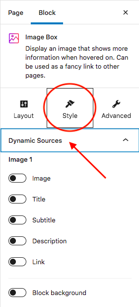
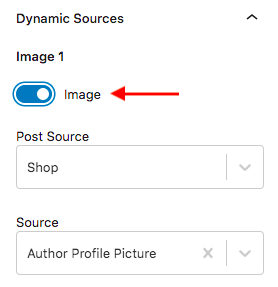

# Selecting Dynamic Sources in Stackable Blocks

You can select dynamic sources under the Style tab, in the **Dynamic Sources** section.

Enable the specific options necessary, and then select your custom field. It will appear after you've selected them.

Keep doing this for all necessary options until you are done.

After you finish enabling and selecting your dynamic sources, you can style it any way you want to.

### **What you can build with this**

There are different types of content you can create with this integration such as:

* Custom Search
* Archive Pages
* Content Template
* Dynamic lists

For more information about how to use the Dynamic Sources with Toolset, you can watch this video guide:



To learn more, visit the [Toolset Integration](https://wpstackable.com/toolset-integration/) page on our website. 👍🏼

