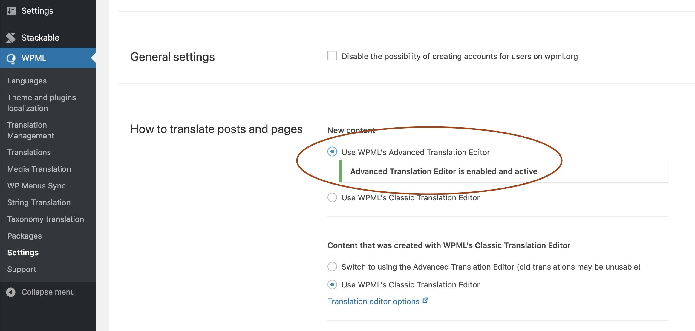
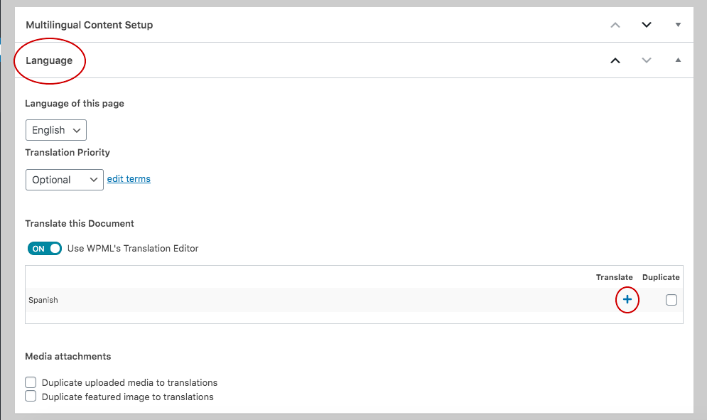
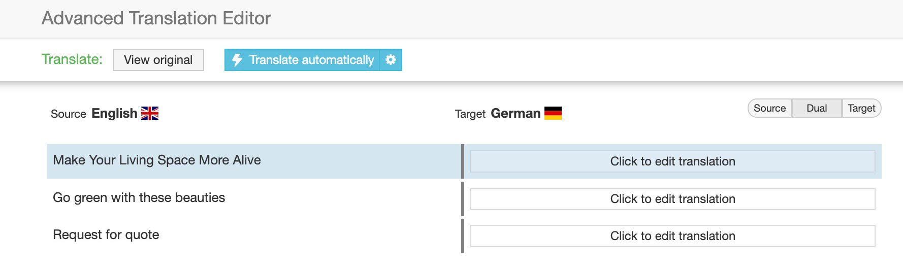
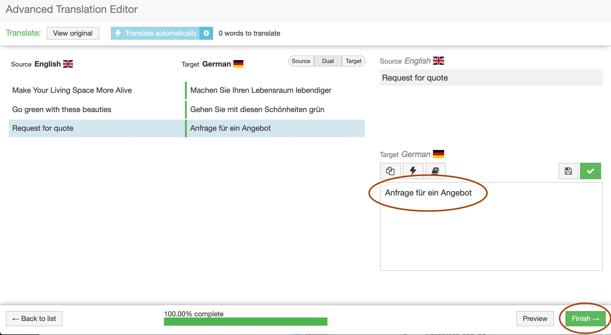
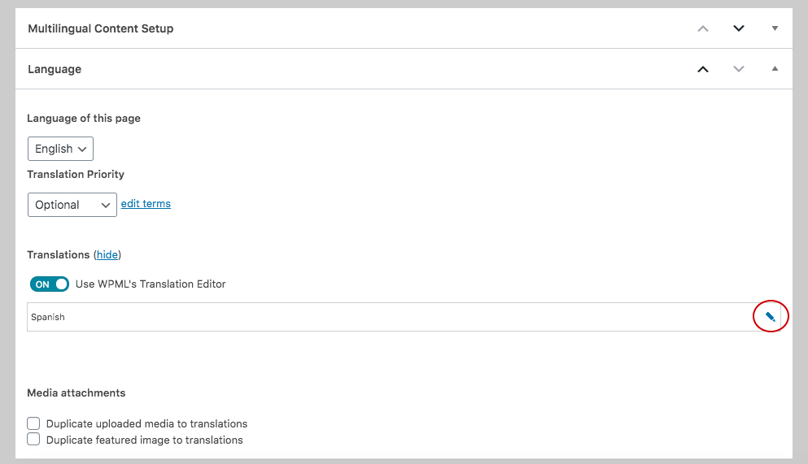

# Translate Blocks Using WPML \(Multilingual\)

You can create multilingual sites using Stackable by using [WPML](https://wpml.org/?aid=290281&affiliate_key=vTs7d84r9UjA). This article will teach you how to use WPML’s Translation Editor to convert a page with Stackable blocks to a different language.

If you’re unfamiliar with [WPML](https://wpml.org/?aid=290281&affiliate_key=vTs7d84r9UjA), it is a Premium WordPress Multilingual Plugin that allows your entire site to be translated and switched from one language to another. This is perfect for when your site needs to be multilingual like many European, South American and Asian sites.


Important note: You will need [**WPML’s Multilingual CMS**](https://wpml.org/purchase/?aid=290281&affiliate_key=vTs7d84r9UjA) and [**WPML Translation Management**](https://wpml.org/purchase/?aid=290281&affiliate_key=vTs7d84r9UjA) solutions for this to work.


### Setting Up WPML

We will need to adjust a setting first in WPML before we begin. Since we are going to translate our block’s contents using WPML’s Translation Editor, we’ll have to enable it first. Make sure that you activate both the **WPML Multilingual CMS** and **WPML Translation Management** plugins ****under the Plugins tab. 

In your WordPress Admin, navigate to **WPML &gt; Settings** and in **How to translate posts and pages**, pick **Use WPML’s Advanced Translation Editor**

Afterwards, create a new page or post.

### Add Your Block

For this example, we’ll be using a Call to Action block and we’ll translate it to _German_. Here’s the block we’ll use:

### Open the WPML Translation Editor

To translate our block, scroll down to the bottom of your page and you will find the **WPML's Languages** panel. Click on the **plus sign \(+\) button** on the language you want to translate your block/page to. This will open up the WPML’s Translation Editor.

### Start Translating

Once WPML’s Translation Editor is open, it should contain all the text found in your page/post and should also contain the text inside your Stackable blocks.

The editor is straight-forward to use and provides on-screen instructions on how to perform the translations.

 Once you complete your translations, go ahead and click on the **Finish** button on the lower right corner of the screen.

### Note: 

If your content changed or you added more blocks to translate, click on the update button in the Languages panel. 

If all the text cannot be seen, update your page and refresh the editor. 

### Viewing Your Translations

After clicking the **Finish** button, you will be brought back to your WordPress block editor. Save your changes view your post/page in the frontend.

Here’s what our original block looks like:

Here’s how our German block looks like:

### Important Notes

* You will need both [**WPML’s Multilingual CMS**](https://wpml.org/purchase/?aid=290281&affiliate_key=vTs7d84r9UjA) and [**WPML Translation Management**](https://wpml.org/purchase/?aid=290281&affiliate_key=vTs7d84r9UjA) ****solutions for this to work.
* You do not need to perform the translations on a per-block basis. Once you enter WPML’s Translation Editor, the entire contents of your post/page will be available there for translation.
* Make sure there is no **Custom XML Configuration** for Stackable
* WPML has a [tutorial in their site](https://wpml.org/documentation/plugins-compatibility/translating-content-created-gutenberg-blocks-plugins/?aid=290281&affiliate_key=vTs7d84r9UjA) as well on how to perform translations for blocks.

