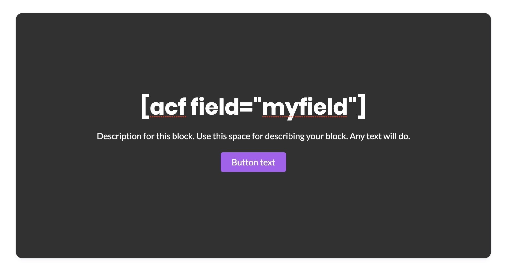
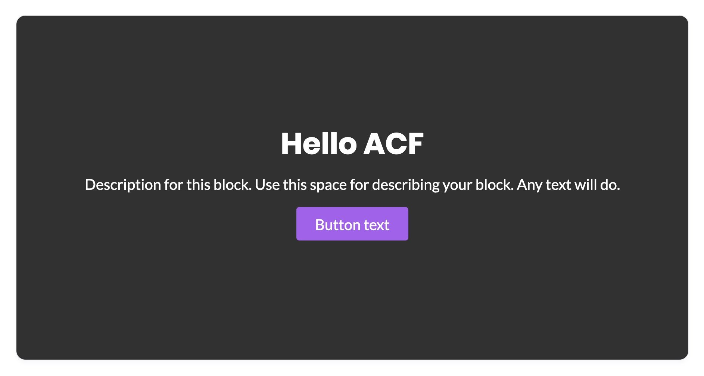

# Using ACF Fields in Blocks \(TODO\)

Learn how to use \(a few of\) your fields in Advanced Custom Fields inside your blocks.

[Advanced Custom Fields](https://www.advancedcustomfields.com/) has been an essential tool for many site creators for taming WordPress custom fields.

Among its many uses, ACF allows people to create tailored user interfaces for adding in custom field data. This allows posts and custom post types to have a streamlined method for creating and managing data.

With ACF it’s easy for people to build post types for a multitude of uses such as directory sites, movie reviews, user upload forms and more.

### ACF Support

Support for ACF’s custom fields is limited to **simple text & number field types**, and **displaying them as text** in blocks.

Here’re the field types you can use:

* Text
* Text Area
* Number
* Range
* Email
* Wysiwyg Editor – The formatting is also displayed 🤘

There are other field types that would technically work, but aren’t really practically useful such as the Url & Select field types.

### Displaying as Text in Blocks

You can display your field values by typing in [acf shortcodes](https://www.advancedcustomfields.com/resources/shortcode/) as text in your blocks.

Let’s say I have a text ACF field with the name `myfield` that contains the string `Hello ACF`. I can display this value in any text in my block by typing in the shortcode:

If you view this in the frontend \(previewing the page won’t work\), you will see that the title gets replace with your field value:

You can do this method for titles, descriptions and button text labels.

Bonus tip: You can also save your block as a **Reusable Block** and it will work as expected across different posts.

### Limitations

Being able to only use ACF shortcodes in rich text in your block brings with it a lot of limitations. Here’re some things you **cannot** do with the shortcode method:

* You can’t use field values as button urls
* You can’t display field values as links
* You can’t use field values as colors
* You can’t use field values as images

In other words, you’re limited to displaying raw field values purely for display purposes.

