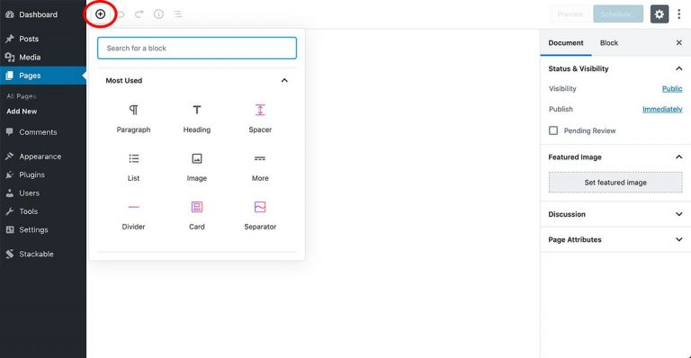
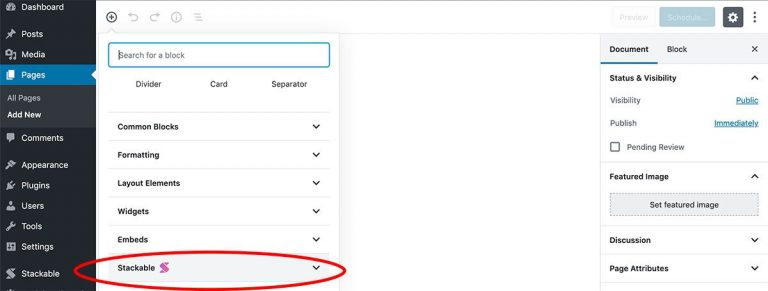
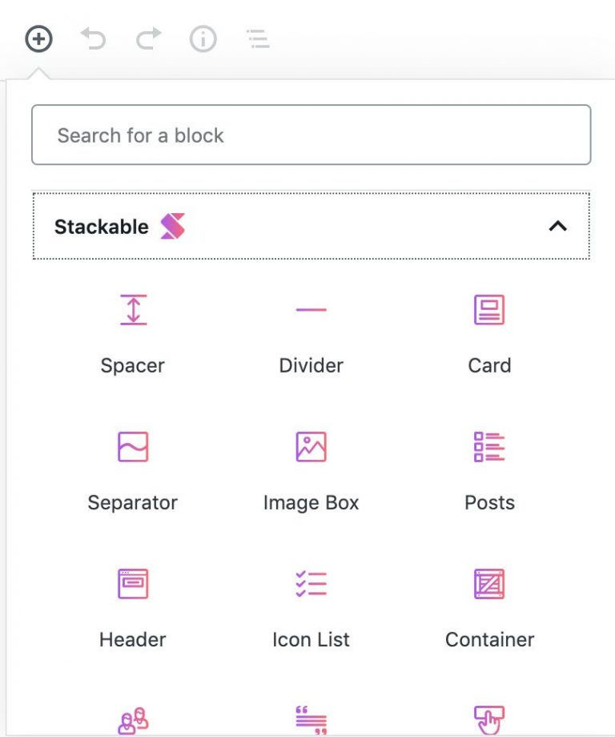
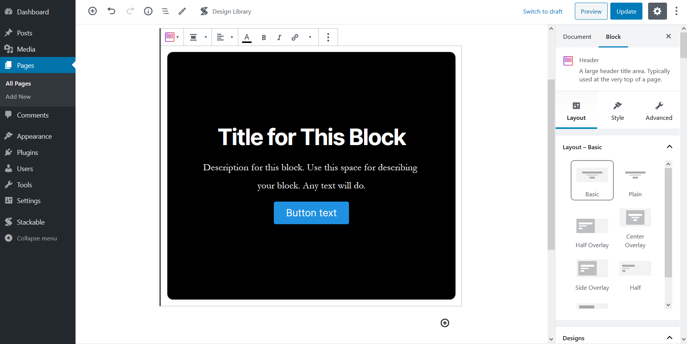

# Adding Stackable Blocks

* Adding Stackable blocks will allow you to use more complex and useful blocks within the Stackable block library.
* Adding Stackable blocks lets you choose blocks with different functions using various layouts and block elements

### **How to Add Stackable Blocks**

* When editing a post or page, click the **Add Block** \(+\) button
* This will open the list of available blocks

*  Scroll to and click on the **Stackable** drawer to reveal all the Stackable blocks

* Click on a block that you want to use


Stackable blocks are easy to spot – just look for the icons in Stackable pink and purple


* After clicking the icon, the Stackable block will be added to your post or page
* As an example, here we added a **Header Block**

Keep on adding as many Stackable blocks as needed and easily build your perfect website. Enjoy! 🤟

