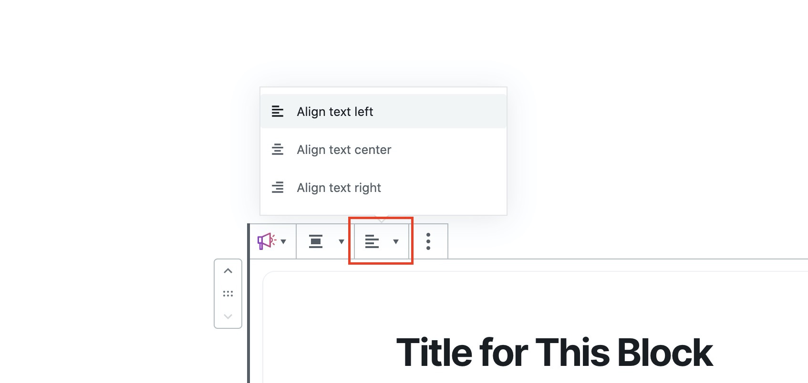
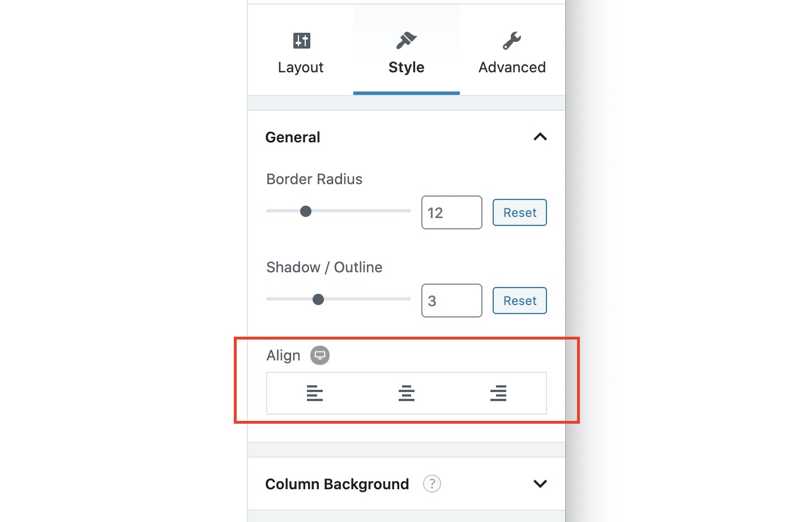
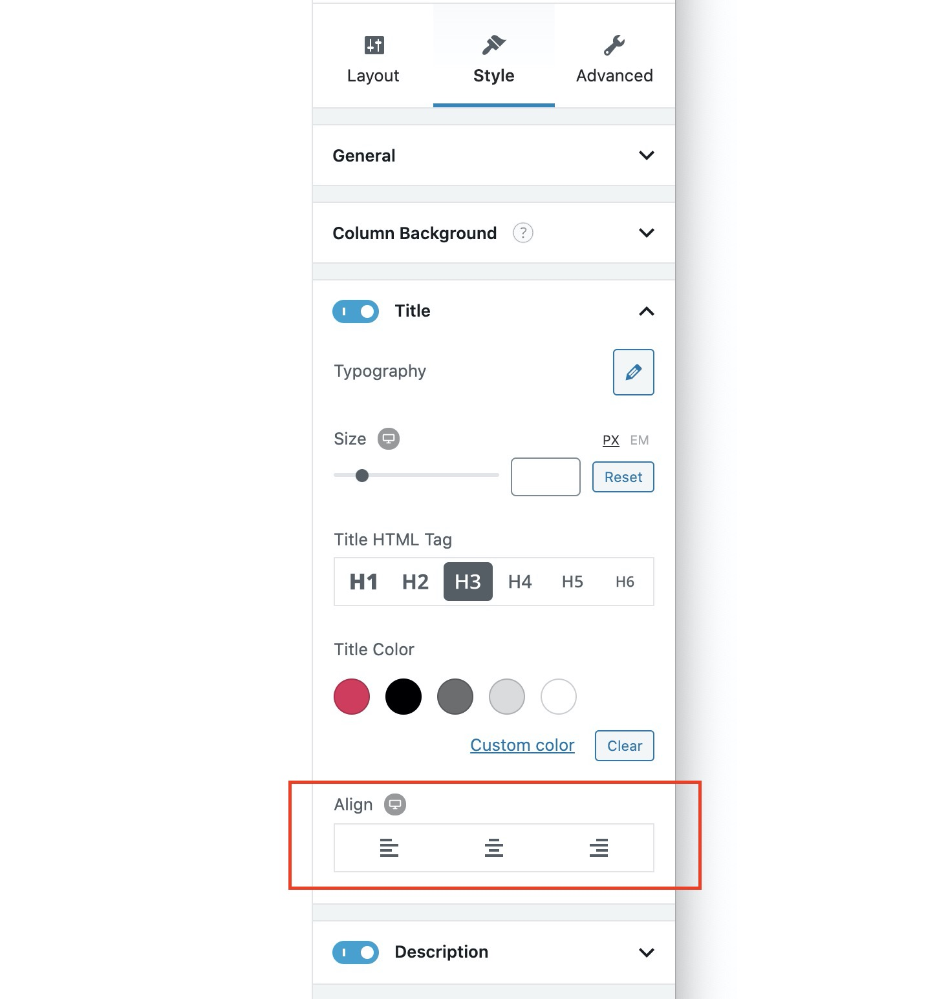

# Aligning Block Content

You can align all the block's content - text and images, by clicking on the **alignment button** in the block's toolbar.

You can also do this from the inspector by going in the **Style Tab &gt; General**, then use the **Align** option.

The above methods change the alignment of all the blocks' content at the same time. If you would like to change the alignment of the individual block elements, you can open up the settings panels of each block element and change their alignments from there.

