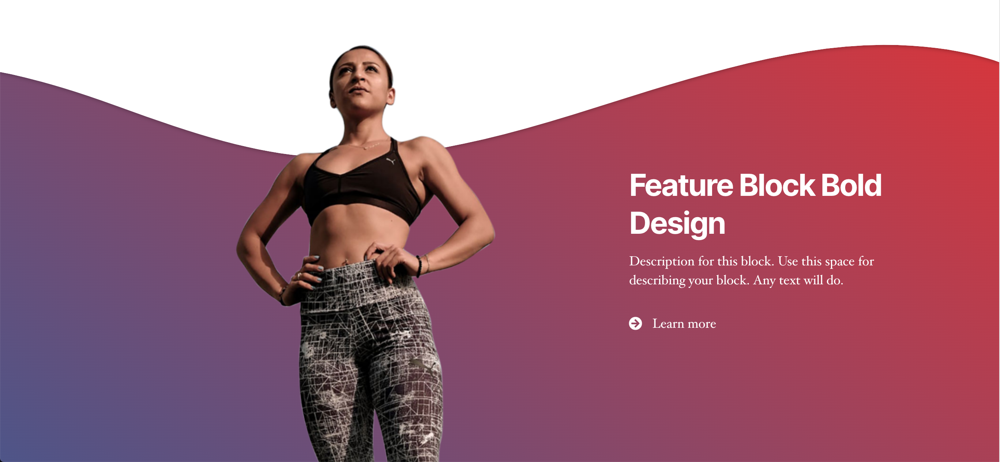
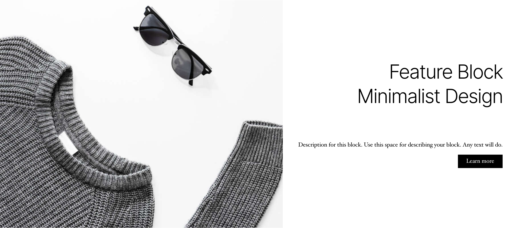
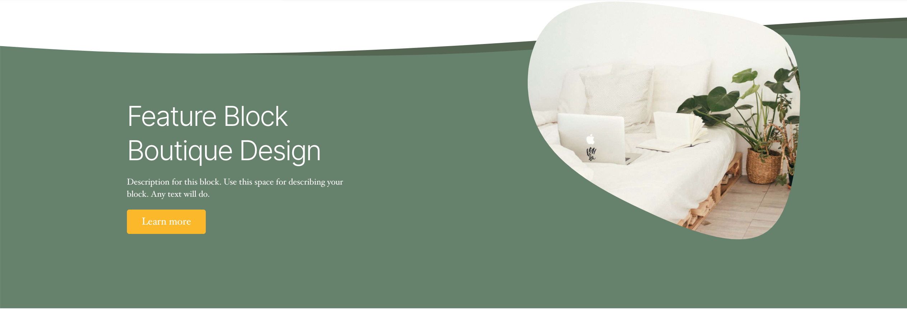
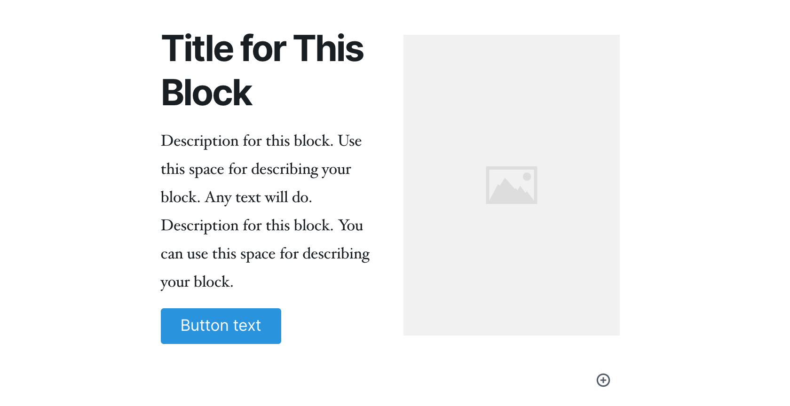
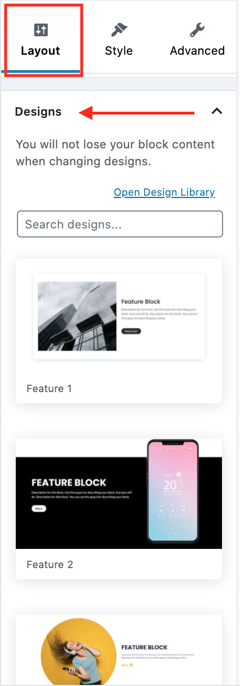

# Block Designs

Stackable offers hundreds of professional block designs that can be used to start building your website. We offer the most diverse sets of designs that are meant to fit the different needs of our users.

### What are Block Designs?

Block Designs are the pre-set designs that you can use to for your website sections. They already have pre-set settings for colors, typography, spacing and other block details that taken together provide a specific feel for the block. They also have built-in images and backgrounds.

As an example, here is the **Feature Block** in different block designs - **bold, minimalist and boutique**. 

### What is the difference between a Block Design and a Block Layout?

Block Layouts are pre-set  placement of different block elements and are meant to serve only as a base to be used for designing. On the other hand, Block Designs already provide pre-set design elements such as images, colors, typography, etc.

Here is a Feature block with a **basic layout but without any Block Design**.

### How do I add Block Designs?

There are two ways of adding block designs: \(1\) through the **Layout Tab** or \(2\) through the **Design Library.**

#### 1. Adding Block Designs through the Layout Tab

To add a Block Design through the Layout Tab, first you need to **add** the Stackable Block of your choice.

After adding the Stackable block, you can choose Block Design through the lower portion of the Layout Tab \(after the Block Layouts\).

#### 2. Adding Block Designs through the Design Library

You can also choose a Block Design through the Design Library. Learn how to use the Design Library here:



### Can I change the Pre-set Elements for the block after I've chosen a Block Design?

The Block Design is meant to be an easy way to build your website. With a simple change of the text content, you can already keep the block as is. However, the user is also given full control to change any settings that you may want to tweak. This means that you can change the images, colors, alignment and any other settings to fit your preference.

### Can I change the Block Design I originally chose?

Yes, you can always change the Block Design you’ve chosen even after inputting your block content. To do this, just go back to the **Layout tab** and switch to the Block Design that you prefer. 

