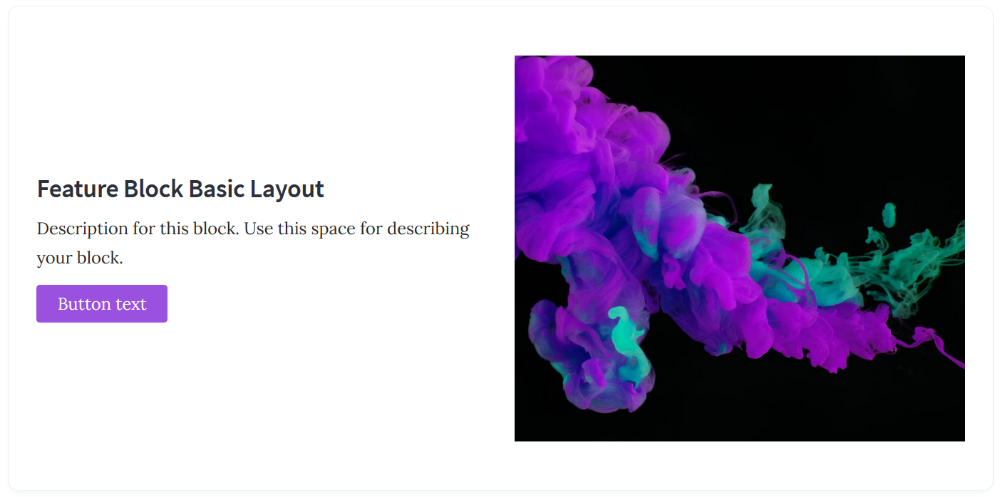
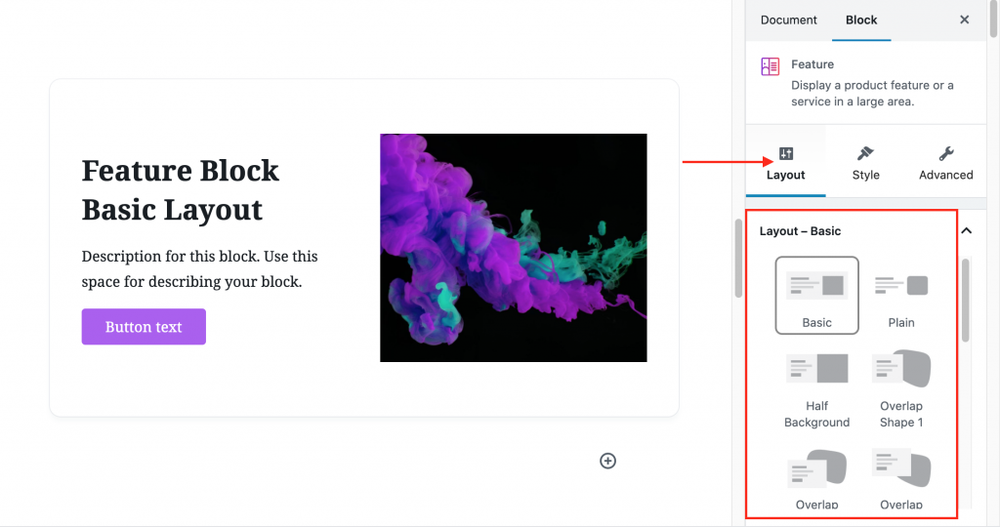
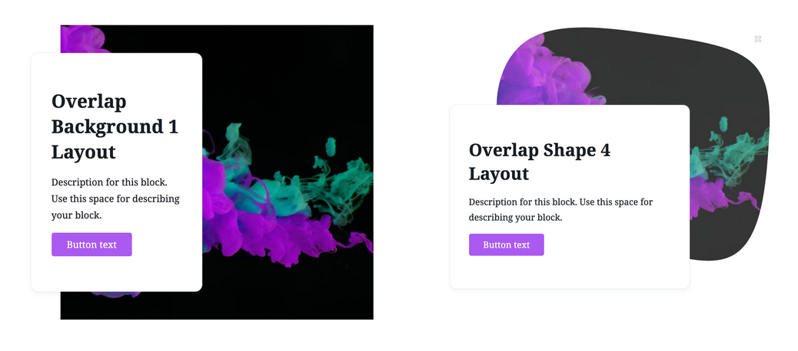

# Block Layouts

One of the unique features of Stackable is having the option of choosing between different layouts for each block. Learn more about the basics of Stackable layouts and how you can maximize the benefits of this very cool feature.

#### What are Layouts?

Layouts are the pre-set placement of different blocks elements for each block. You can think of layouts as the “base” to start you off in designing your blocks.

Here is a feature block with a basic layout. We’ve included an image to make it easier to visualize.

#### 

#### How can I choose a layout?

Choosing the layout that would best fit your website is one of the first steps you will take in designing with Stackable, and it’s very easy.

Each Stackable block already comes with two layouts for free – **basic** and **plain** layouts. To choose your block layout, go to the **Layout tab** in the inspector and you can already choose the layout that you want to use.

#### 

#### Can I get more layout options?

If you want even more layout options than the basic and plain, [Stackable Premium](https://wpstackable.com/premium/) will let you choose from more than **120+ layout options** across all Stackable blocks. Here are some premium layouts for the feature block:

#### Can I change the layout I originally chose?

Yes, you can always change the layout you’ve chosen even after inputting your block contents. To do this, just go back to the **Layout tab** and switch to the layout that you prefer.

Don’t worry if you’ve already designed your block extensively. You can always switch between block layouts with just one click without losing any of your content.

Let us know what else you want to learn about layouts and other Stackable features.

