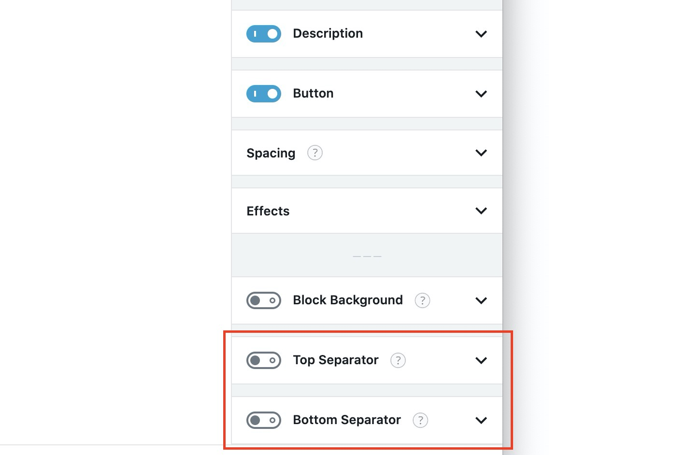

# Block Separators




You can use **Block Backgrounds** in along with Block Separators to achieve some great effects.


Almost every Stackable block can have Block Separators / Shape Dividers.

To turn these on, select a block, then go to the **Style Tab** and turn on the **Top Separator** or **Bottom Separator**.

You can modify the different settings of top and bottom separators inside their own individual panels.



