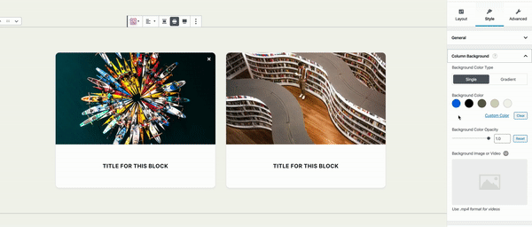
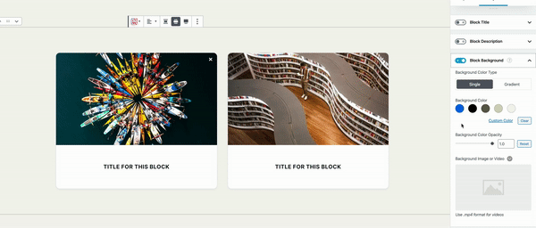
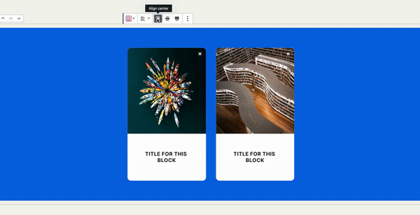
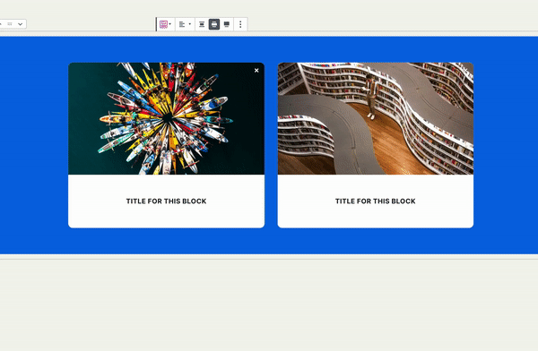

# Column Backgrounds and Block Backgrounds \(TODO\)

This article will help you understand the column backgrounds and block backgrounds. How these two types of backgrounds are different and how to use them in your designs.

TLDR: Use Column Backgrounds to change container styles, and use Block Backgrounds to turn blocks into whole sections.



If you’ve played around in the style tab of some blocks, you might have noticed that some blocks have column background settings and block background settings.

You may come across similar columns and block settings within blocks, while these settings look similar and may sometimes even behave similarly, they’re quite different from each other.

Knowing the difference between column backgrounds and block backgrounds opens up a lot of design and layout opportunities.

### Column Backgrounds


 If a block doesn’t support multiple columns, the settings for Column Backgrounds are called **Container Backgrounds**.


Stackable blocks have a very distinguishable design. A lot of times, our blocks have a box or a container with rounded borders.

You can see this across many of our blocks, such as the Card Block.

**This box / container is what’s being controlled by the Column Backgrounds settings.**

You may also notice that in most “plain” layouts, the Column Background settings aren’t present since the box or container isn’t usually present in this layout.

### Block Backgrounds

Block backgrounds on the other hand have quite a special purpose.

Turning on a block’s Block Background option turns the block into an _entire section_ for your page. This is similar to the native Cover block’s ability to go full-width, only better.

**When turning on the Block Background, you can specify the background of the whole section the block occupies.**

Not only that, but you can still change the width of the block contents, you can still adjust the contents to be centered, wide or full-width.

Shape separators also jive well with Block Backgrounds. With Block Backgrounds turned on, your Top and Bottom Separators would appear on the edges of your section.

