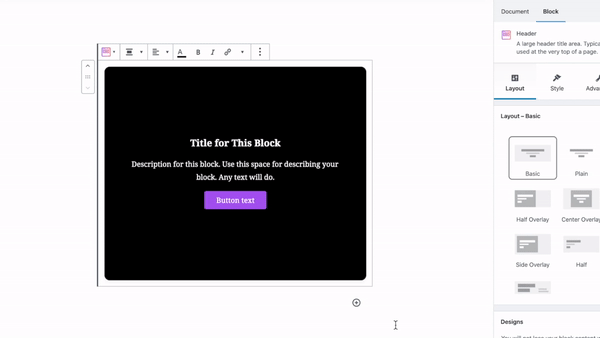
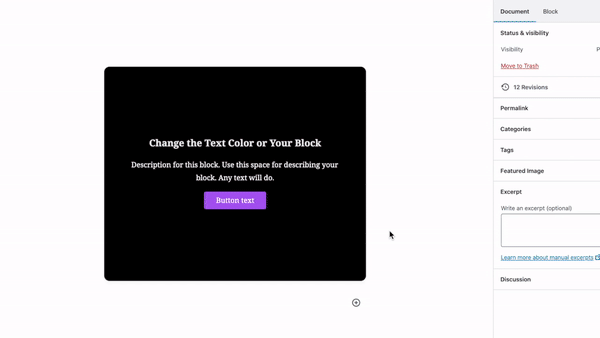
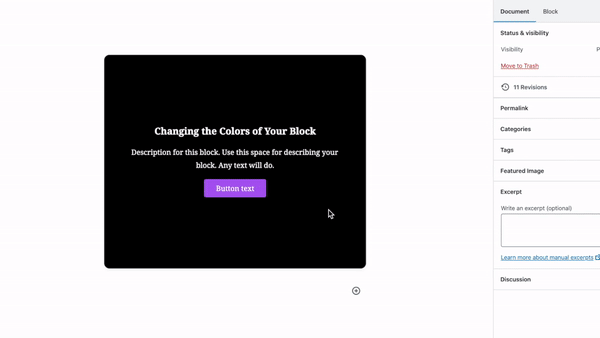
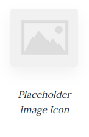
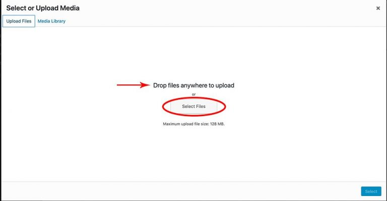
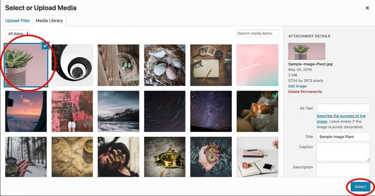
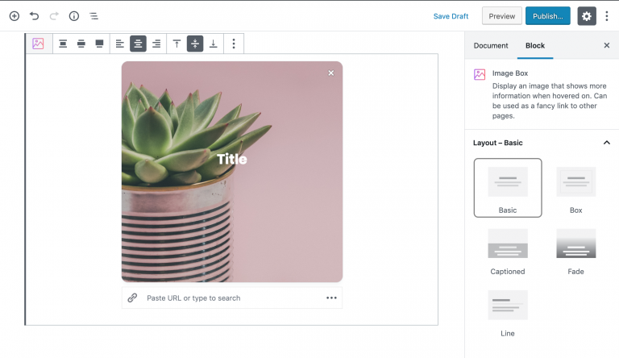
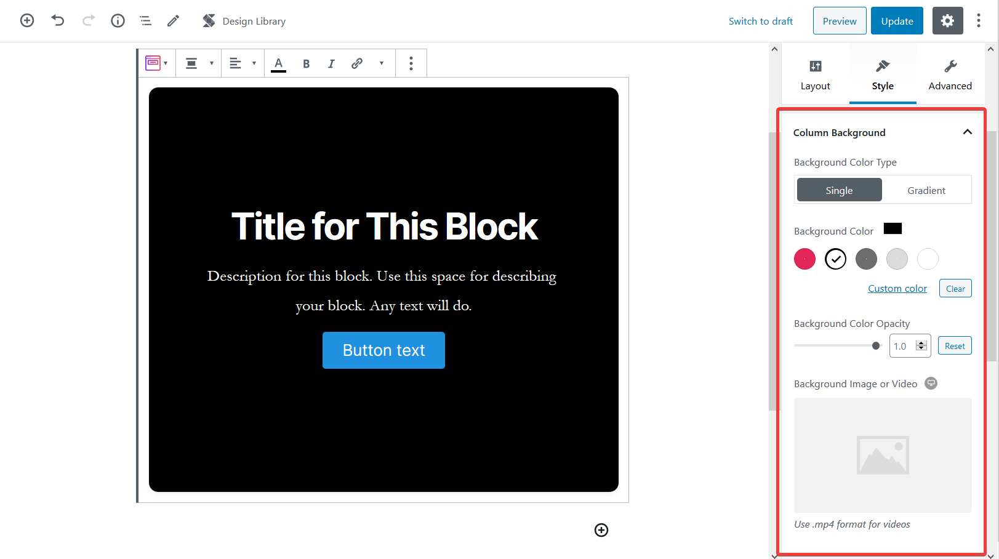

# Customizing Blocks

#### Adding Content Using Stackable

**What it’s For**

* Your content, as they say, is the point of it all. The main reason for having a website is to showcase your content.
* Using Stackable allows you to showcase your content easily and beautifully.

**How to Do It**

**Adding Text**

* **Click** on the _**part of the Stackable block**_ where you want to add your text and **delete** the _**placeholder text.**_
* The placeholder text will be grayed out when it is already deleted.
* Type in _**your own text.**_

**Modifying Text Colors**

* Modify text colors in the **inspector.**
* Scroll to the **Color Settings** section and click the _**text color**_ of the text you want to modify.
* Select colors from the **palette** or use the **custom color picker.**

*  You can also change the **text color or highlight selected text** form the tool bar.

**Adding an Image**

* You can add images in block areas where you see a _**placeholder image icon.**_

* **Click** on block that you want to edit.
* **Click** the _**placeholder image icon**_ where you want to add your image to open the **Select or Upload Media pop-up.**
* Upload the image you want to use by either \(1\) **dropping files** into the **Select or Upload Media pop-up** or **\(2\) clicking** the _**Select File button.**_

* The image you upload will be added to the **Media Library.**
* Make sure the image you want is **checked**, then click the _**Select button.**_

* Your image will then appear in your Stackable block
* We are using the **Image Box block** as an example here

**Adding an Image or Video as Background**

* There are Stackable blocks that let you add **images or** **videos** as background. These blocks will show **background settings** in the inspector.

* Click the _image icon_ in the background image setting and follow the same steps as **adding an image** above to add images and videos in the background.

Go to town with adding different content using Stackable blocks. 🤓

