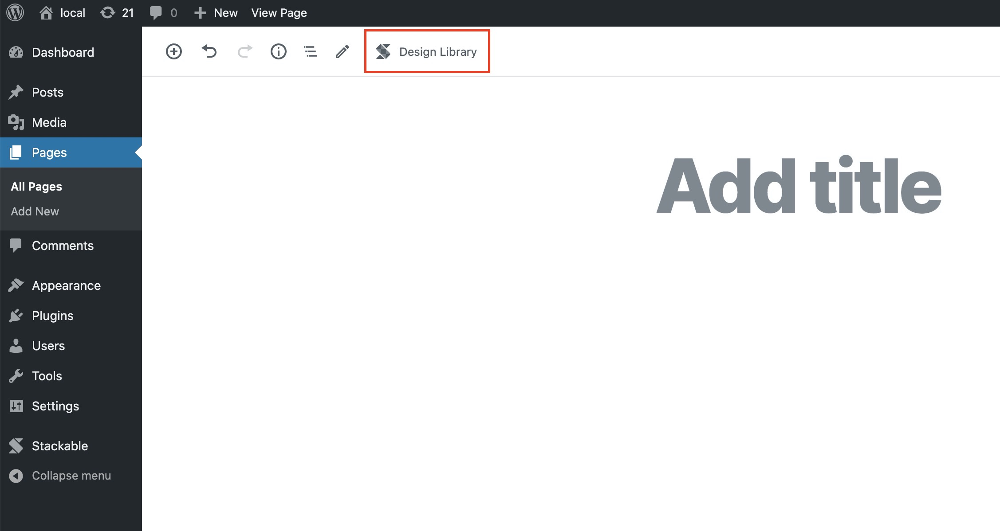
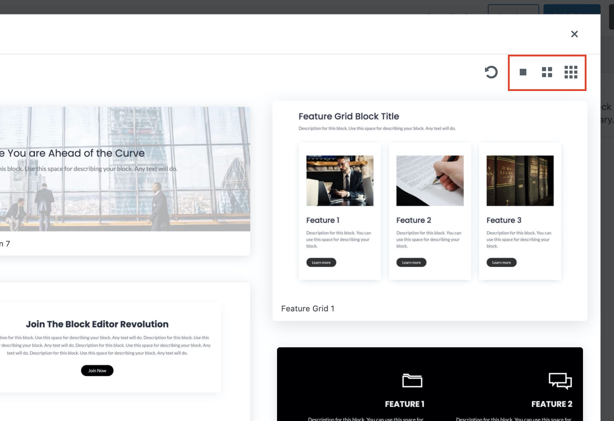

# Design Library

Click on the **Design Library** button on the top of the Block Editor. This will open the Stackable Design Library, this contains hundreds of pre-made designs that you can easily use in your pages.

In the Design Library, you can use the left pane to filter out the different designs. You can filter and search for:

* block type \(e.g. call to action\)
* colors \(e.g. blue\)
* light or dark
* design name \(e.g. minimalist\)

You can also toggle between viewing larger, normal or smaller design previews using the buttons on the upper right.

The Design Library refreshes the library once a day. When release new designs, you can get these right away by clicking on the refresh button.

