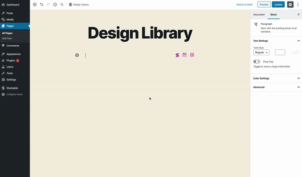
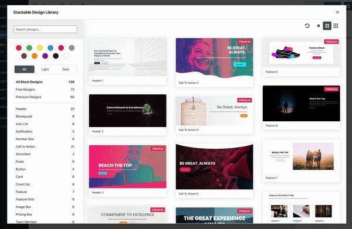

# Design Library

 You should see on the top of your screen the Stackable **“Design Library” button**. Click it to bring up the Design Library popup which as of this writing contains **290 block designs**.

Once you have the Design Library open, you can use the left pane to filter out the different designs. You can search for specific colors, blocks, light or dark designs and design names.

You can also toggle between viewing larger, normal or smaller design previews as well.

