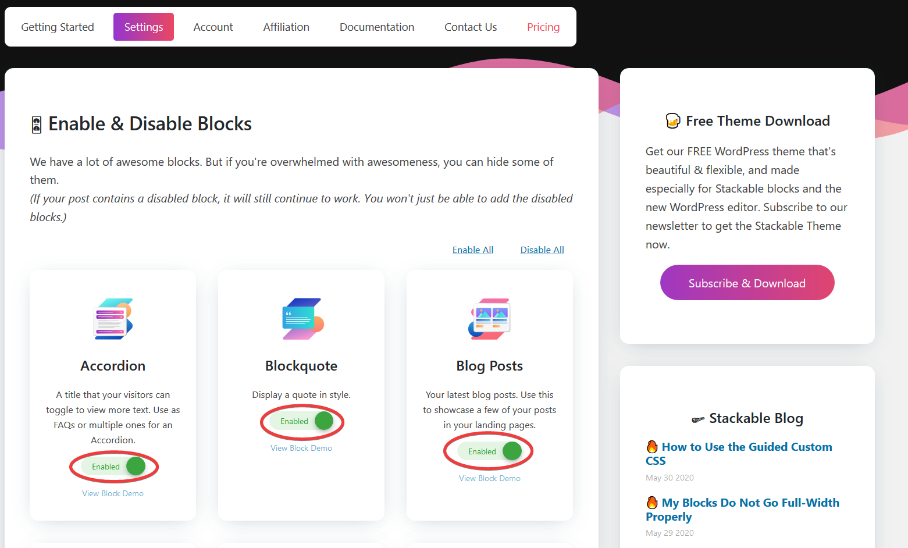
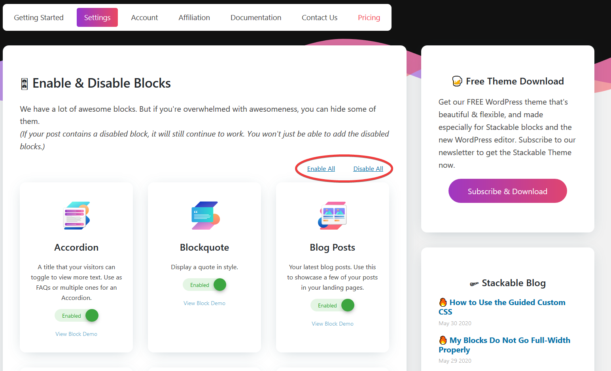

# Enabling / Disabling Blocks

Enabling/disabling Stackable blocks allows you to choose which Stackable blocks you can access and use when editing your pages and posts.

* Enabled Stackable blocks will appear in the **Add Block Pop-up** under the **Stackable Drawer**.
* Disabled Stackable blocks will NOT appear in the **Add Block Pop-up**.
* Disabling Stackable blocks will NOT affect blocks that you previously added to your post or page. These blocks will continue to work on your posts or pages unless you manually remove them.

### **How To Do It**

* Navigate to **Stackable &gt; Settings** in your WordPress admin.
* Toggle between **Enable / Disable** block settings for each Stackable block

*  There are also controls for enabling and disabling **all Stackable blocks**

