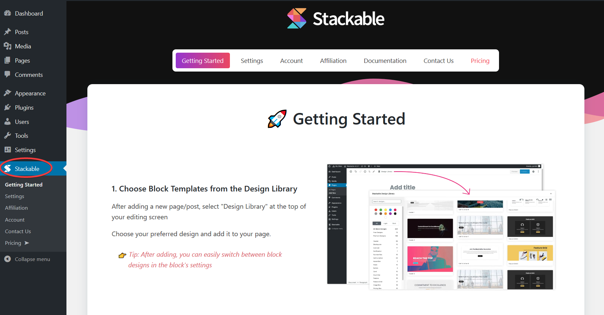
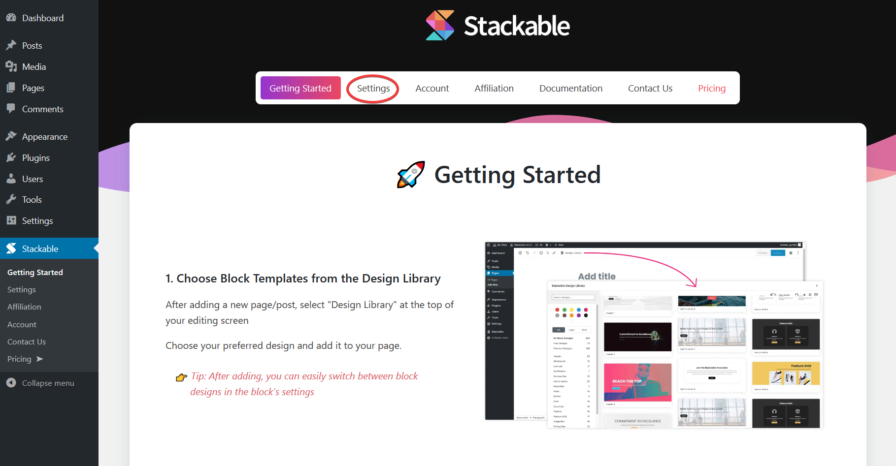

# Enabling / Disabling Blocks \(TODO\)

### **What it’s For**

* Enabling/disabling Stackable blocks allows you to choose which Stackable blocks you can access and use when editing your pages and posts.
* Enabled Stackable blocks will appear in the **Add Block Pop-up** under the **Stackable Drawer**.
* Disabled Stackable blocks will NOT appear in the **Add Block Pop-up**.
* Disabling Stackable blocks will NOT affect blocks that you previously added to your post or page. These blocks will continue to work on your posts or pages unless you manually remove them.
* You can enable/disable the Stackable blocks through the Stackable page in the admin.

### **How To Do It**

* When you first activate Stackable on your WordPress site, Stackable will be added to your admin menu and the Stackable page will appear
* Navigate to the **Stackable Page** through the **admin menu**

* Click **Settings**

* Toggle between _**Enable / Disable**_ block settings for each Stackable block
* Each Stackable block can be enabled and disabled **individually**

*  There are also controls for enabling and disabling **all Stackable blocks**

While we know that you need the liberty to choose the Stackable blocks you’ll use \(hence the enable/disable options\), we encourage you to give each Stackable block a spin. They’re all awesome. 😇

