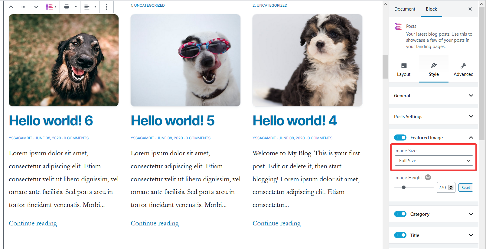

# Image Sizes

What are Image Sizes?

Images Sizes corresponds to the width and height dimensions of the loaded image, but this is sometimes different from the displayed image size \(since the image can be cropped to fit columns or to become square shaped\).


Larger image sizes may affect your page loading speed, so if you want to load your site faster, you can choose smaller image sizes.


