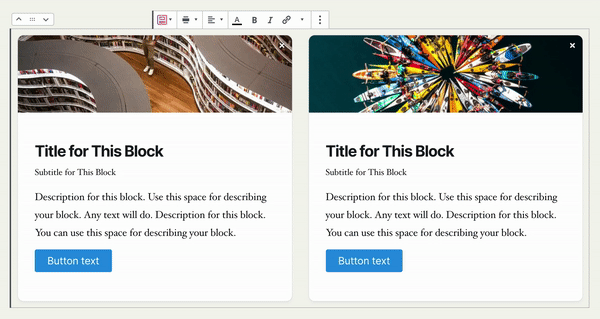

# Removing the Block Elements

### Removing Block Components

Stackable blocks come with different areas or block elements. While these elements are all useful, some designs require that some block elements be removed.

To remove the different components of your blocks, select your block then in the Block Inspector, navigate to the **Style tab**.

In there you will find the individual toggles that you can use to enable/disable the different parts of your block.

### Removing Parts of a Column

For blocks containing multiple columns, you may encountered times when you only want to remove a specific block component in one column. In these cases, you can simply delete the **placeholder text** or **other text you previously used** to remove from the column.

This works for buttons and images as well. Just remove the text of buttons, or remove any images in your block.

While some faded placeholder text still appears in the editor, the text won’t appear in the frontend of your site.

