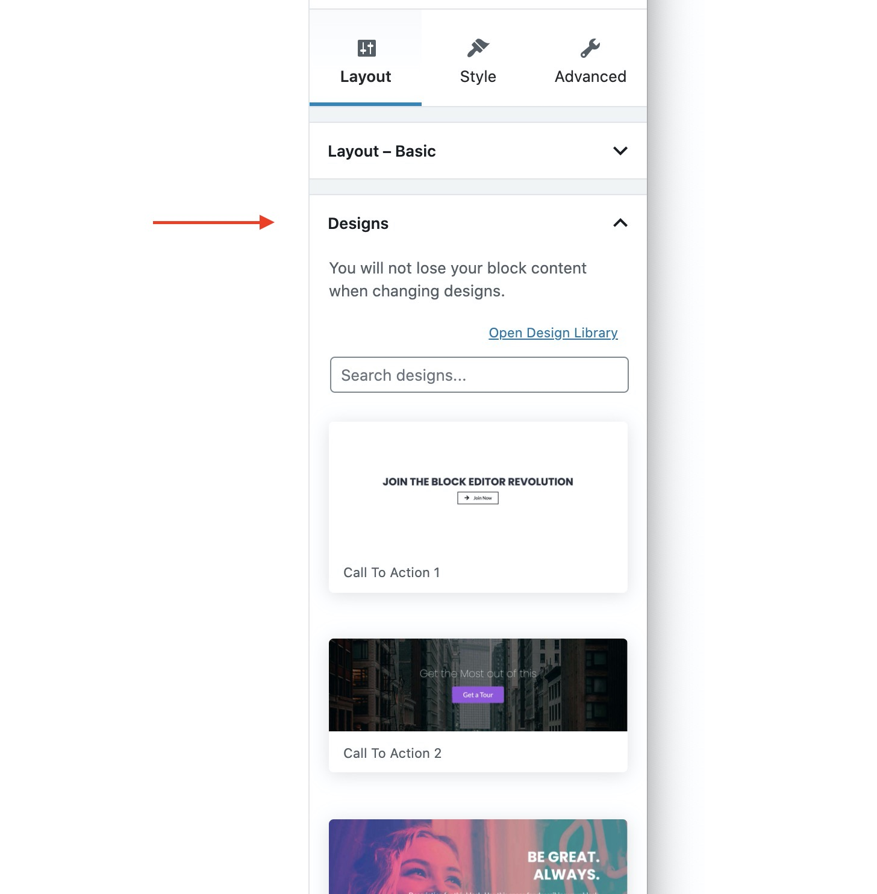

# Switching Block Designs

The block designs available from the Design Library are also available within the **Layout Tab** under the **Designs** panel. You can easily switch between the different block designs by simply clicking on a design.


Your block content will remain intact even when changing block designs.

You can hit **undo** to quickly revert back to the previous design.


