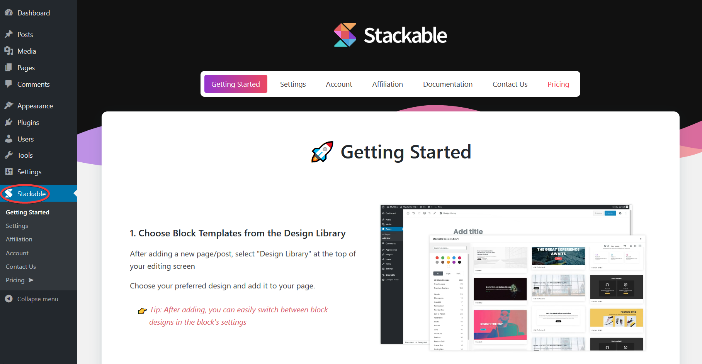

# Installing the Plugin

**Through the Dashboard**

* On your WordPress dashboard click **Plugins** &gt; _Add New_
* Search for **Stackable** through the search box
* Click the _**Install Now**_ button, then click _**Activate**_

**Through the Stackable Website**

* Go to [**wpstackable.com**](https://wpstackable.com/) then click _**Free Download**_
* On your WordPress dashboard click **Plugins** &gt; _Add New_
* Click _**Upload Plugin**_, and use the Stackable file you downloaded
* Once uploaded, _**activate**_ the plugin

Once Stackable is activated, it will be added to your admin menu and the Stackable page will appear:

This completes the installation of Stackable in your WordPress site. 🥳

When you add new blocks to your page using the block editor, Stackable blocks will already be in the add block pop up. Enjoy! 😊

