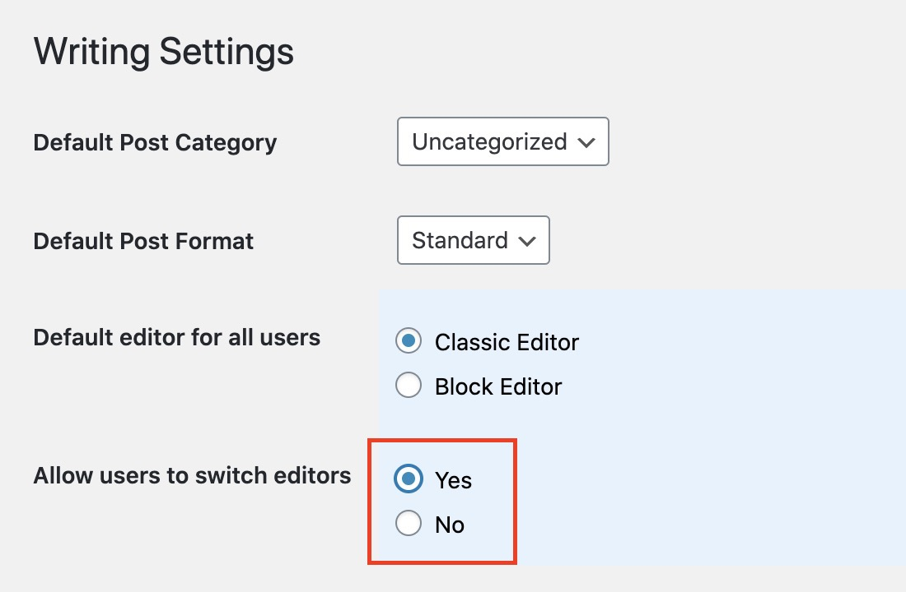
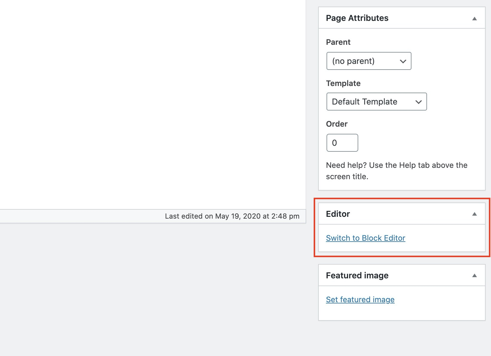
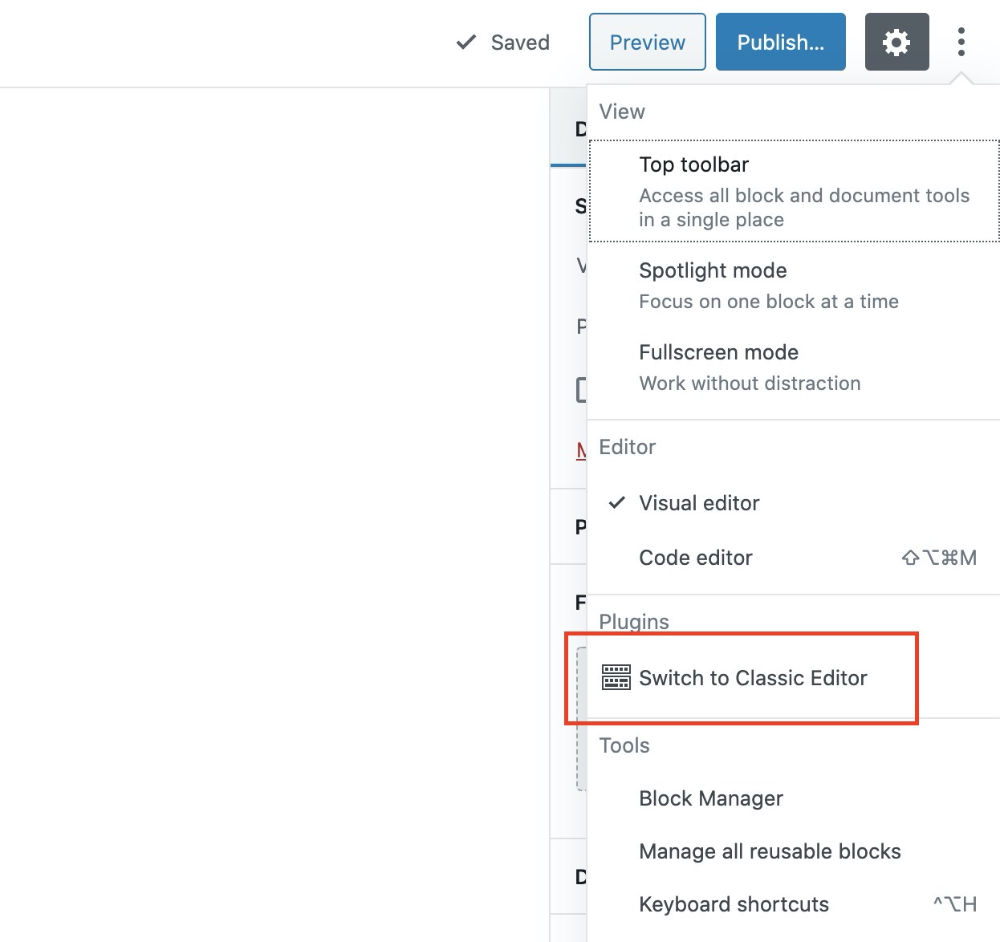

# Can I Use the Block Editor and the Classic Editor at the Same Time?

You can still use the Classic Editor by installing the [Classic Editor plugin](https://wordpress.org/plugins/classic-editor/).

When you have this plugin activated, by default you will only be given the choice to edit your pages and posts using the Classic Editor only.

If you would like to be able to switch between the Classic Editor and the Block Editor when editing, you can navigate in your admin to **Settings &gt; Writing**, then make sure you have the option **Allow users to switch editors** in **Yes**

When you have this option to Yes, you should see a **Switch to the Block Editor** link when editing in the Classic Editor.

When in the Block Editor, you can also switch to the Classic Editor by clicking on the **More Tools & Options** button on the upper right corner of the screen \(the one that has 3 dots\)

