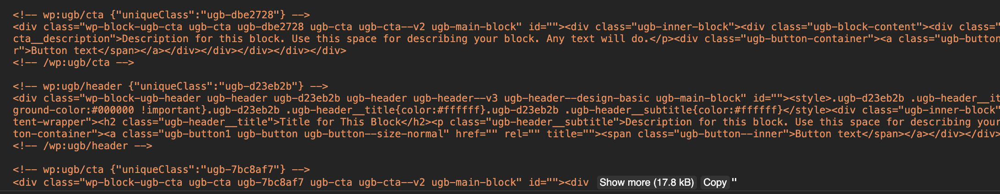

# How To Report Block Errors

If some of your blocks are encountering errors on a regular basis, please let us know, we will try out best to resolve things as soon as we can.

### Give us a Copy of Your Page's Content

So that we can fix the block errors, we will need a copy of your page content so we can investigate your blocks further.


Unfortunately you can't just copy what you see in the Block Editor when an error occurs. The Block Editor performs some adjustments on your page's content when it loads. We will need the original content before the Block Editor gets a hold of it.


To get your page's original content, open your [browser's console](https://developers.google.com/web/tools/chrome-devtools/console/javascript) and type in the following command:

```javascript
wp.data.select('core/editor').getCurrentPost().content
```

After typing that in, the console will get a bunch of HTML:



Copy all this content and send this to us. \(If you're content it quite long, there should be a copy button on your console\).




