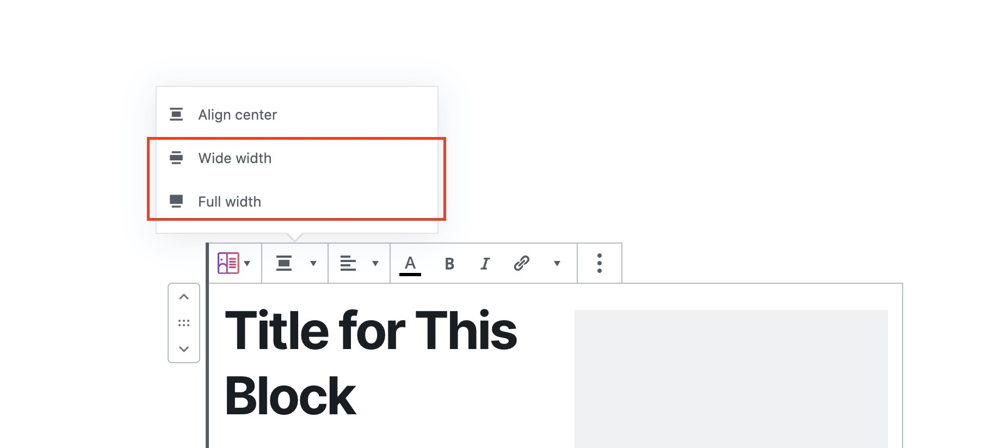

# I Can't See the Wide Width and Full Width Buttons in My Toolbar

When you have a block selected, you should see the **Wide Width** and **Full Width** buttons in your block's toolbar.

If you don't see these buttons, this means that the theme you are currently using isn't **Gutenberg-ready** or isn't **Block Editor-ready**. This simply means that your theme hasn't enabled some Block Editor features such as the Wide Width and Full Width block options.

To resolve this, you will have to contact your theme author and ask them to update your theme and make it support these new WordPress features.

