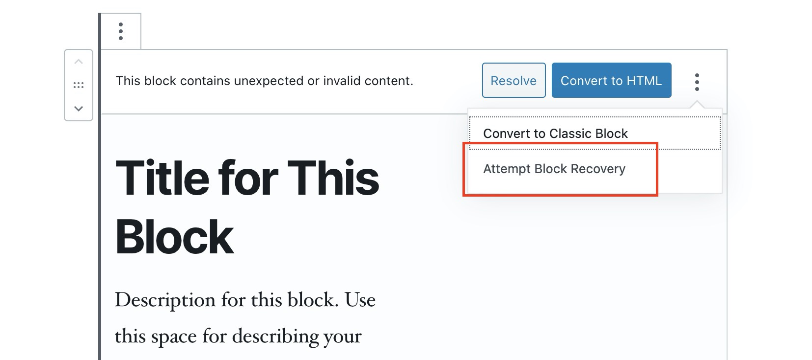
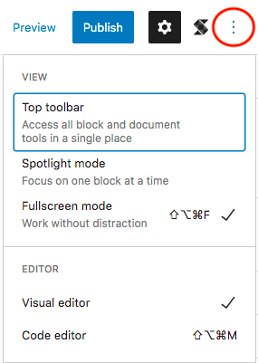
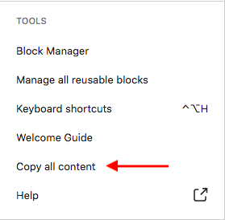

# I'm Encountering Block Errors

### Common Reasons for Block Errors in Stackable

There are various reasons why blocks in the Block Editor encounter errors. 

Here are the most common reasons why a block may encounter an error:

#### 1. You have the Gutenberg plugin activated

The Gutenberg plugin contains a lot of new or experimental features in the block editor which aren't that stable yet. If you don't need those new or experimental features in Gutenberg, it will be better to deactivate the plugin and just use the Gutenberg that's already included in WordPress.

Deactivate the Gutenberg plugin, and our blocks should not be encountering such errors anymore.

**2. The block doesn't exist**

Our blocks will show an error if Stackable was deactivated or uninstalled. This is also the same with any other plugin that provides blocks.

#### 3. The block structure changed or the block's code was modified

The Block Editor has very strict block validation rules, this means that when your page's content changes \(and those changes affect a block's code or structure\), the block can show an error.


We don't advise you to manually edit a block's code, since there's a high chance that this would produce a block error.


#### 4. The block had a bug that got fixed

Sometimes a block may have an issue that we fixed. If this is the case, you can do an **Attempt Block Recovery** to quickly fix things.


Stackable is smart enough to do this automatically in anticipation of bug fixes.


#### 5. You Moved to an Older Version of Stackable

If you created a block using a newer versions of Stackable, and downgraded to an older version, your block might contain some features which were not present in an older version.

#### 6. You downgraded from Stackable Premium to Free

If you created a block using Stackable Premium and downgraded to Stackable Free, you block would have used premium features which were are not present in Stackable Free.

### Common Fixes to Block Errors

Here are some common solutions when your Stackable block produces an error:

#### 1. Reverse your manual adjustments

If you manually modified a block, you will have to revert your changes. You can use WordPress' revisions feature to roll back your changes.

#### 2. Attempt Block Recovery

You can do an **Attempt Block Recovery** to quickly fix the block.

#### 

#### 3.  Get the code of the blocks that produced the error

You can also get the code of the blocks that produced the error and send it as a text file to our support team.

Here are the steps to get the code of the blocks of a page:

1. Edit the page or post wherein the block error occurs
2. Click on the Options button on the top right of the Block Editor

    3. Scroll down and select "Copy all content"

  4. Paste the contents in a text file and send it to our support team at support@wpstackable.com

#### 4. Don't touch the block if it looks fine in the frontend

If your block looks fine and works normally in the frontend but has an error in the Block Editor, you can opt to just leave the block alone \(even if it shows an error\).

It's possible that the error only resides within the Block Editor and doesn't affect your frontend at all.

#### 5. Don't touch the block and ask us for support

If you think we have a bug and that's the reason the block error happened, please contact us so we can issue a fix. If it is indeed a bug, you can just ignore the block for now \(don't touch it\), and it should get fixed by the time we release an update.





#### 

