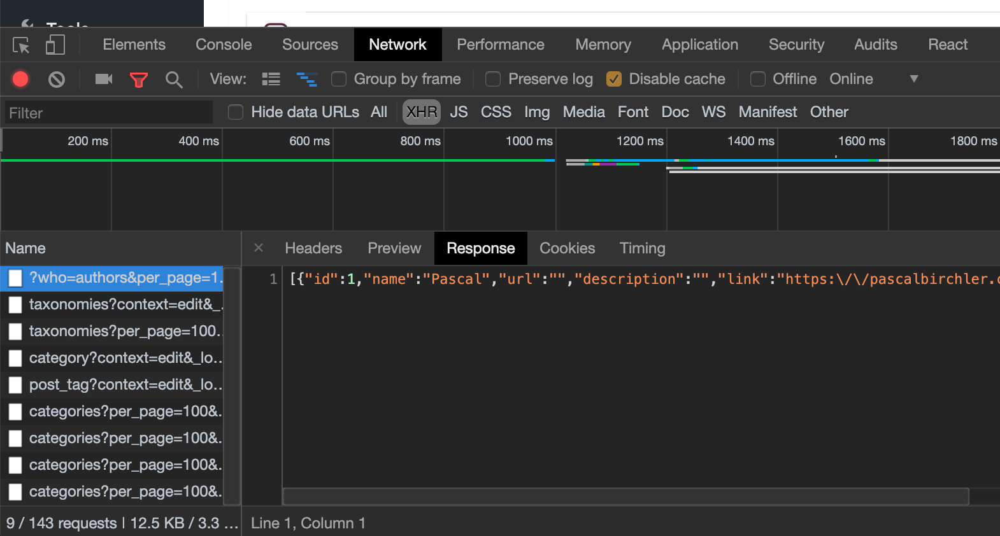

# I'm Getting the Error "Updating failed. The response is not a valid JSON response" \(TODO\)

  
1. Head over to **Settings &gt; Permalinks**, then click on **Save Changes**. Afterwards, check whether the saving error still occurs.  
  
2. You may have some **debugging or performance** plugin or setting turned on that occasionally places in performance metrics on pages, mostly things that measure "Peak Memory Usage" or the number of "SQL Queries". Turn those off and check whether that fixes the saving issue.  
  
3. You may have an incorrectly set up **SSL** settings and your site may be serving "mixed content" \(serving both HTTPS and HTTP content\). If you're using CloudFlare, make sure you're setting for Encryption Mode is set to "Full \(Strict\)" mode. And also make sure that you're forcing all content to be served using HTTPS \(this can be fixed either in your CDN settings, web hosting settings, or using an SSL plugin like Really Simple SSL [https://wordpress.org/plugins/really-simple-ssl/](https://wordpress.org/plugins/really-simple-ssl/) \)  
  
4. Make sure that your **.htaccess** rules are correctly set up. Here's what the .htaccess file normally would look like: [https://www.hostinger.ph/tutorials/create-default-wordpress-htaccess-file](https://www.hostinger.ph/tutorials/create-default-wordpress-htaccess-file)  
  
If none of those work, then you'll have to check what the WordPress save call is actually returning. To do this, you'll have to view the actual call response in your browser's developer tools.   
  
1. Right anywhere on the page, then select "Inspect" or "Inspect Element" to bring up the browser's developer tools.  
2. Navigate to the "Network" tab of the developer tools  
3. Click on "XHR" in order to view only ajax calls  
  
You should end up with something that looks like this: 

Once you're there, save your page, then check last of the newly added entries in the network tab. Check the "Headers" tab of the new entry and you should see "/wp-json/..." in the "Request URL" to indicate that it's a rest API call. Check the "Response" tab, the contents of that should ideally start with "{...". 

