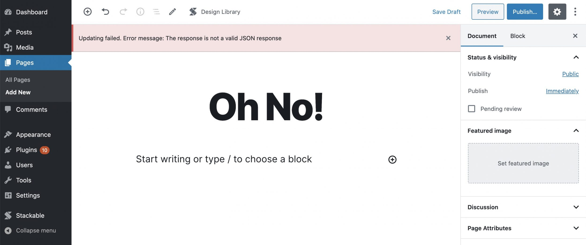
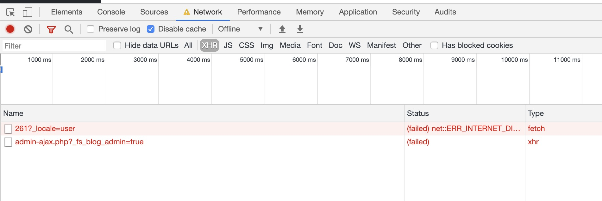

# I'm Getting the Error "Updating failed. The response is not a valid JSON response" \(TODO\)

This is a dreaded error that sometimes shows up after trying to update or publish a WordPress post or page.

When this error pops up, it’s a bit of a challenge to understand what’s going on since the error is so cryptic and doesn’t provide any concrete cause of the error.

Here are some tried and tested solutions that you can easily do to fix the error, and I’ll also let you know why they happen:

### Solution \#1

Head over to **Settings &gt; Permalinks**, then click on **Save Changes**. Afterwards, check whether the saving error still occurs.

**Cause / Reason:**

WordPress uses [URL rewriting](https://en.wikipedia.org/wiki/Rewrite_engine) for a number of things. Some to make URLs more reader or SEO friendly, or sometimes for internal needs such as custom post type URLs.

There’s a chance that when URL rewriting is adjusted in your site, the changes don’t get reflect right away. By saving your permalink changes, it forces the URL rewriting rules to be updated.

### Solution \#2

Turn off debugging or performance display metrics such as “Peak Memory Usage” or the number of “SQL Queries”

**Cause / Reason**

Some debugging or performance plugins occasionally prints out performance metrics on pages. These metrics can be found if you open up the source of your webpages.

Sometimes, these metrics gets placed also in some areas that may cause some normal WordPress functions to result in an error – such as when saving posts.

### Solution \#3

If you’re using SSL \(your site URL shows “http**s**” and not “http”\), make sure your site serves all HTTPS content.

Head over to **Settings &gt; General**, and make sure your **WordPress Address \(URL\)** and **Site Address \(URL\)** both start with “https://”

If you’re using CloudFlare, make sure you’re setting for Encryption Mode is set to “Full \(Strict\)” mode.

Also make sure that you’re forcing all content to be served using HTTPS \(this can be fixed either in your CDN settings, web hosting settings, or using an SSL plugin like [Really Simple SSL](https://wordpress.org/plugins/really-simple-ssl/)

**Cause / Reason**

When you’re site is using SSL \(when the URL shows “https”\) and if your site is serving “mixed content” or both https and http URLs, and depending on your site set up, browsers could show a warning or won’t be able to load some URLs.

When this happens, some essential WordPress URLs may become inaccessible and might also affect the saving process.

### Solution \#4

Make sure that your .htaccess rules are correctly set up.

Hostinger has a great article on how the [.htaccess file should normally look like](https://www.hostinger.ph/tutorials/create-default-wordpress-htaccess-file).

**Cause / Reason**

This is similar to the cause of the previous solution. What happens is that since your .htaccess file isn’t correctly set up, then some essential WordPress URLs may become inaccessible.

### If None of the Solutions Above Work

If none of those work, then you’ll have to check what the WordPress save call is actually returning. To do this, you’ll have to view the actual call response in your browser’s developer tools. For Chrome:

1. Right anywhere on the page, then select “Inspect” or “Inspect Element” to bring up the browser’s developer tools.
2. Navigate to the “Network” tab of the developer tools
3. Click on “XHR” in order to view only ajax calls

You should end up with something that looks like this:

Once you’re there, save your page, then check last of the newly added entries in the network tab.

Check the “Headers” tab of the new entry and you should see “/wp-json/…” in the “Request URL” to indicate that it’s a rest API call.

Check the “Response” tab, the contents of that may give a clue on what’s happening.

