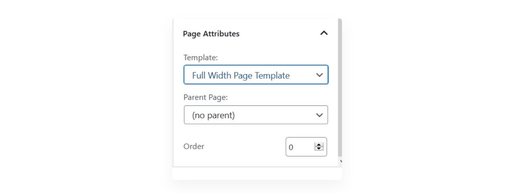

# My Blocks Do Not Go Full-Width Properly

Your theme normally dictates how the contents are shown in your pages.

Sometimes, blocks may not show up in full-width properly. When this happens, most of the time things get fixed by using a full-width page template.

Themes usually provide this type of template. To see if this is the case, please see if your page attributes have something like this:

If your theme doesn’t have a full-width page template, there are a few plugins that that provide this type of functionality.

Here’s a free one from the WordPress Plugin Directory called [​Fullwidth Templates for Any Theme & Page Builder](https://wordpress.org/plugins/fullwidth-templates/) \(we are not affiliated with the plugin\)

Your mileage may vary depending on your ​theme though, so if you find that this method doesn’t work, you can also manually create your own Full Page Template. [ThemeIsle has a great article](https://themeisle.com/blog/full-width-page-wordpress-plugin/) discussing how to do this.

