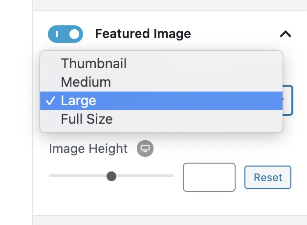

# When I Pick an Image Size, It Always Shows the Full Image

If you're selecting a different image size for your blocks, e.g. thumbnail or medium...

but it always shows the full uploaded image regardless of what image size you pick, it's possible that the resized images aren't available in your site.

Typically, WordPress generates these different sized images every time you upload a new image, more notably, your site generates a thumbnail, medium and large sized image. These images could become missing due to a number of reasons such as:

* Your theme, or a plugin installed is preventing the other image sizes from being generated
* A media cleanup tool previously got rid of the generated image sizes

A possible fix for this issue to regenerate these images in WordPress. You can do this through the help of image utility plugins such as [Regenerate Thumbnails](https://wordpress.org/plugins/regenerate-thumbnails/).

